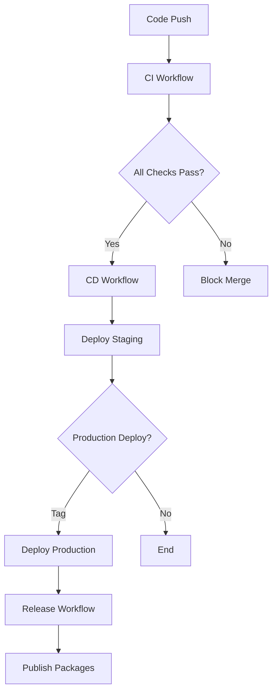

# GitHub Workflows & CI/CD Documentation

This document describes the GitHub Actions workflows, Dependabot configuration, and build checks set up for the Council of Nycea monorepo.

## 🚀 Workflows Overview

### 1. CI Workflow (`.github/workflows/ci.yml`)

**Triggers:** Push to `main`/`develop`, Pull Requests
**Purpose:** Continuous Integration for all components

**Jobs:**
- **Changes Detection:** Determines which parts of the codebase changed
- **Frontend CI:** Builds and tests React/Vite frontend
- **Backend Shared:** Builds shared packages first (dependency order)
- **Backend Services:** Builds all microservices in parallel
- **API Gateway:** Builds and tests the API gateway
- **Docker Build:** Tests Docker image building
- **Security Scan:** Runs Trivy vulnerability scanner

**Key Features:**
- ✅ Smart change detection (only runs relevant jobs)
- ✅ Parallel execution for faster builds
- ✅ Proper dependency order (shared → services)
- ✅ Caching for faster subsequent runs
- ✅ Artifact uploads for debugging

### 2. CD Workflow (`.github/workflows/cd.yml`)

**Triggers:** Push to `main`, Tags (`v*`), Manual dispatch
**Purpose:** Continuous Deployment to staging/production

**Jobs:**
- **Build and Push:** Creates Docker images for all services
- **Frontend Build:** Builds production frontend assets
- **Deploy Staging:** Deploys to staging environment
- **Deploy Production:** Deploys to production (tags only)
- **Notify:** Sends deployment notifications

**Key Features:**
- ✅ Multi-service Docker builds
- ✅ Environment-specific deployments
- ✅ Manual deployment triggers
- ✅ Slack notifications
- ✅ GitHub Container Registry integration

### 3. Release Workflow (`.github/workflows/release.yml`)

**Triggers:** Push to `main`, Manual dispatch
**Purpose:** Automated semantic versioning and releases

**Jobs:**
- **Release:** Uses Release Please for semantic versioning
- **Publish Packages:** Publishes shared packages to NPM
- **GitHub Release:** Creates GitHub releases with assets

**Key Features:**
- ✅ Conventional commit parsing
- ✅ Automatic changelog generation
- ✅ NPM package publishing
- ✅ Release asset creation

### 4. PR Checks Workflow (`.github/workflows/pr-checks.yml`)

**Triggers:** Pull Request events
**Purpose:** Comprehensive PR validation

**Jobs:**
- **PR Info:** Displays PR metadata
- **Commit Linting:** Validates conventional commits
- **Frontend Checks:** Linting, type checking, building
- **Backend Checks:** Linting, type checking, building
- **Security Checks:** Vulnerability scanning and audits
- **Documentation Checks:** Markdown linting and link checking
- **PR Summary:** Posts check results as PR comment

**Key Features:**
- ✅ Conventional commit enforcement
- ✅ Bundle size monitoring
- ✅ Security vulnerability detection
- ✅ Documentation validation
- ✅ Automated PR summaries

### 5. CodeQL Workflow (`.github/workflows/codeql.yml`)

**Triggers:** Push, PR, Weekly schedule
**Purpose:** Advanced security analysis

**Features:**
- ✅ JavaScript/TypeScript analysis
- ✅ Security and quality queries
- ✅ Weekly scheduled scans
- ✅ SARIF upload to GitHub Security

### 6. Performance Workflow (`.github/workflows/performance.yml`)

**Triggers:** Push to `main`, PR, Weekly schedule
**Purpose:** Performance monitoring and testing

**Jobs:**
- **Frontend Performance:** Lighthouse CI, bundle analysis
- **Backend Performance:** Service performance testing
- **Load Testing:** K6 load tests (scheduled)
- **Memory Profiling:** Node.js memory analysis

**Key Features:**
- ✅ Lighthouse performance metrics
- ✅ Bundle size analysis
- ✅ Load testing with K6
- ✅ Memory profiling with Clinic.js

### 7. Stale Management (`.github/workflows/stale.yml`)

**Triggers:** Daily schedule
**Purpose:** Automatic stale issue/PR management

**Features:**
- ✅ 30-day stale marking
- ✅ 7-day auto-close
- ✅ Exempt labels for important issues
- ✅ Customizable messages

## 🤖 Dependabot Configuration

**File:** `.github/dependabot.yml`

**Update Schedule:**
- **Monday:** Frontend and backend root dependencies
- **Tuesday:** Shared packages
- **Wednesday:** Backend services
- **Thursday:** API Gateway
- **Friday:** Docker and GitHub Actions

**Features:**
- ✅ Grouped dependency updates
- ✅ Staggered schedule to avoid conflicts
- ✅ Conventional commit messages
- ✅ Automatic reviewers and assignees

## 📋 Issue & PR Templates

### Issue Templates
- **Bug Report:** `.github/ISSUE_TEMPLATE/bug_report.md`
- **Feature Request:** `.github/ISSUE_TEMPLATE/feature_request.md`

### PR Template
- **Pull Request:** `.github/PULL_REQUEST_TEMPLATE.md`

**Features:**
- ✅ Structured information gathering
- ✅ Comprehensive checklists
- ✅ Service-specific sections
- ✅ Testing requirements

## ⚙️ Configuration Files

### Commitlint (`commitlint.config.js`)
- Enforces conventional commits
- Service-specific scopes
- Proper commit message formatting

### Lighthouse CI (`.lighthouserc.json`)
- Performance thresholds
- Accessibility requirements
- SEO and best practices checks

## 🔧 Setup Requirements

### Repository Secrets
```bash
# Required for CD workflow
GITHUB_TOKEN          # Automatic (GitHub provides)
NPM_TOKEN             # For package publishing
SLACK_WEBHOOK         # For deployment notifications
STAGING_API_URL       # For load testing

# Optional for enhanced features
AWS_ACCESS_KEY_ID     # For S3 deployment
AWS_SECRET_ACCESS_KEY # For S3 deployment
```

### Repository Settings
1. **Branch Protection Rules:**
   - Require PR reviews
   - Require status checks
   - Require up-to-date branches
   - Restrict pushes to main

2. **Environments:**
   - `staging` - Auto-deploy from main
   - `production` - Manual approval required

3. **Labels:**
   ```
   bug, enhancement, documentation, security, 
   stale, pinned, work-in-progress, needs-triage
   ```

## 🚦 Build Status Badges

Add these to your README.md:

```markdown
[](https://github.com/your-org/council-of-nycea/actions/workflows/ci.yml)
[](https://github.com/your-org/council-of-nycea/actions/workflows/cd.yml)
[](https://github.com/your-org/council-of-nycea/actions/workflows/codeql.yml)
```

## 📊 Monitoring & Metrics

### Performance Monitoring
- Lighthouse CI reports
- Bundle size tracking
- Load test results
- Memory profiling data

### Security Monitoring
- Trivy vulnerability scans
- CodeQL security analysis
- Dependency audits
- SARIF uploads to GitHub Security

### Quality Metrics
- Test coverage reports
- Linting results
- Type checking status
- Build success rates

## 🔄 Workflow Dependencies



## 🛠️ Troubleshooting

### Common Issues

1. **Build Failures:**
   - Check shared package build order
   - Verify TypeScript configurations
   - Review dependency versions

2. **Docker Build Issues:**
   - Ensure Dockerfiles exist for all services
   - Check build context paths
   - Verify multi-stage build steps

3. **Performance Test Failures:**
   - Check Lighthouse thresholds
   - Verify test environment setup
   - Review performance budgets

### Debug Commands

```bash
# Local testing
npm run lint
npm run build
pnpm run build-shared
pnpm run build-services

# Docker testing
docker build -t test-image ./backend
docker run --rm test-image

# Performance testing
npx lighthouse-ci autorun
```

## 📚 Best Practices

1. **Commit Messages:** Use conventional commits
2. **PR Size:** Keep PRs focused and small
3. **Testing:** Include tests for new features
4. **Documentation:** Update docs with changes
5. **Security:** Regular dependency updates
6. **Performance:** Monitor bundle size and metrics

## 🔮 Future Enhancements

- [ ] E2E testing with Playwright
- [ ] Visual regression testing
- [ ] Automated security scanning
- [ ] Performance budgets
- [ ] Deployment rollback automation
- [ ] Multi-environment testing
- [ ] Advanced monitoring integration 