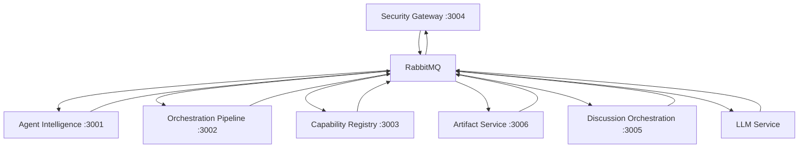

# Service Architecture & Routing

## Service Boundaries and Responsibilities

### 1. Security Gateway (Port 3004)
**Primary Responsibility**: Authentication, authorization, and user management

**Routes**:
- `/api/v1/auth/*` - Authentication (login, logout, MFA)
- `/api/v1/security/*` - Security validation and policies
- `/api/v1/approvals/*` - Approval workflows
- `/api/v1/audit/*` - Audit trail management
- `/api/v1/users/*` - User management and preferences
- `/api/v1/knowledge/*` - Personal knowledge CRUD
- `/api/v1/llm/*` - LLM provider configuration
- `/api/v1/contacts/*` - Contact management

**Communication**: 
- Publishes auth validation events via RabbitMQ
- No direct HTTP calls to other services

### 2. Agent Intelligence (Port 3001)
**Primary Responsibility**: AI agent management and orchestration

**Routes**:
- `/api/v1/agents/*` - Agent CRUD operations
- `/api/v1/personas/*` - Agent persona management
- `/api/v1/discussions/*` - Agent discussion management
- `/api/v1/knowledge/chat-import` - Chat ingestion and processing
- `/api/v1/knowledge/generate-qa` - AI-powered Q&A generation
- `/api/v1/conversation-enhancement/*` - Conversation intelligence

**Communication**:
- Subscribes to auth events from Security Gateway
- Publishes agent events for other services
- Communicates with LLM Service via RabbitMQ

### 3. Orchestration Pipeline (Port 3002)
**Primary Responsibility**: Workflow orchestration and project management

**Routes**:
- `/api/v1/operations/*` - Operation execution
- `/api/v1/tasks/*` - Task management
- `/api/v1/projects/*` - Project management
- `/api/v1/projects/:id/tasks/*` - Project task operations
- `/api/v1/projects/:id/agents/*` - Project agent assignment
- `/api/v1/projects/:id/tool-usage/*` - Tool usage tracking
- `/api/v1/projects/:id/metrics/*` - Project metrics

**Communication**:
- Orchestrates multi-service workflows via RabbitMQ
- Publishes workflow events
- Coordinates with Capability Registry for tool execution

### 4. Capability Registry (Port 3003)
**Primary Responsibility**: Tool and capability management

**Routes**:
- `/api/v1/tools/*` - Tool registry and management
- `/api/v1/capabilities/*` - Capability discovery
- `/api/v1/mcp/*` - Model Context Protocol integration
- `/api/v1/oauth-adapters/*` - OAuth capability adapters

**Communication**:
- Executes tools on behalf of other services
- Publishes tool execution events
- Sandboxed execution environment

### 5. Artifact Service (Port 3006)
**Primary Responsibility**: Artifact generation and short link management

**Routes**:
- `/api/v1/artifacts/*` - Artifact CRUD and generation
- `/api/v1/links/*` - Short link management (authenticated)
- `/api/v1/:shortCode` - Short link resolution (authenticated)
- `/s/links/*` - Public short link management
- `/s/:shortCode` - Public short link resolution

**Communication**:
- Subscribes to discussion completion events
- Generates artifacts from conversations
- Publishes artifact creation events

### 6. Discussion Orchestration (Port 3005)
**Primary Responsibility**: Real-time agent discussions

**Routes**:
- WebSocket endpoint for real-time discussions
- No REST API routes (event-driven only)

**Communication**:
- WebSocket connections for real-time communication
- Subscribes to auth validation events
- Publishes discussion events to RabbitMQ
- Triggers artifact generation on completion

### 7. LLM Service (No dedicated port)
**Primary Responsibility**: LLM provider integration

**Communication**:
- RabbitMQ event-driven only
- No direct HTTP endpoints
- Handles LLM requests from all services
- Multi-provider support (OpenAI, Anthropic, Ollama)

## Cross-Service Communication Patterns

### Authentication Flow
```
User Request → Security Gateway → RabbitMQ Event → Other Services
```

### Project Workflow
```
Project Creation → Orchestration Pipeline → RabbitMQ Events → Agent Intelligence/Capability Registry
```

### Discussion to Artifact
```
Discussion Completion → RabbitMQ Event → Artifact Service → Generate Artifact
```

### Tool Execution
```
Service Request → RabbitMQ Event → Capability Registry → Execute Tool → Response Event
```

## Event Bus Topics

### Security Events
- `security.auth.validate` - Request auth validation
- `security.auth.response` - Auth validation response
- `security.policy.updated` - Security policy changes

### Agent Events
- `agent.created` - New agent created
- `agent.updated` - Agent configuration updated
- `agent.discussion.started` - Agent discussion initiated

### Project Events
- `project.created` - New project created
- `project.task.assigned` - Task assigned to agent
- `project.tool.used` - Tool usage recorded

### Discussion Events
- `discussion.started` - Discussion initiated
- `discussion.message` - New discussion message
- `discussion.completed` - Discussion completed

### Artifact Events
- `artifact.generation.requested` - Artifact generation requested
- `artifact.created` - Artifact successfully created
- `artifact.shared` - Artifact shared via short link

## Service Dependencies



## Port Allocation

| Service | Port | Type |
|---------|------|------|
| Security Gateway | 3004 | HTTP/REST |
| Agent Intelligence | 3001 | HTTP/REST |
| Orchestration Pipeline | 3002 | HTTP/REST |
| Capability Registry | 3003 | HTTP/REST |
| Discussion Orchestration | 3005 | WebSocket |
| Artifact Service | 3006 | HTTP/REST |
| LLM Service | N/A | RabbitMQ Only |

## Deployment Notes

1. **Service Isolation**: Each service runs independently with its own process
2. **Shared Dependencies**: All services share database connections via @uaip/shared-services
3. **Event-Driven**: Services communicate primarily through RabbitMQ events
4. **No Direct HTTP**: Services should not make direct HTTP calls to each other
5. **Gateway Pattern**: External clients only interact with services through their REST APIs
6. **WebSocket**: Real-time features use WebSocket connections through Discussion Orchestration