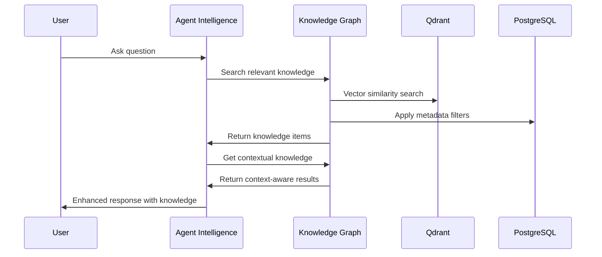
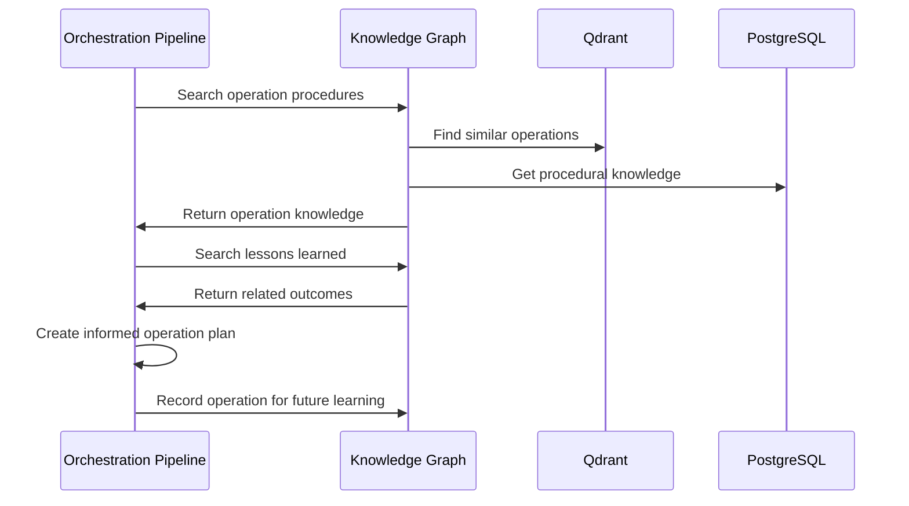
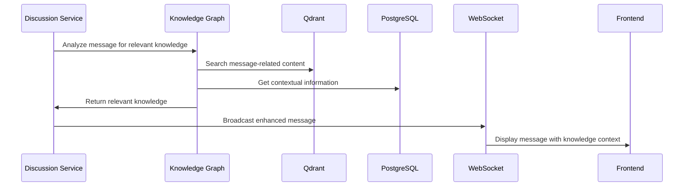

# Epic 2: Knowledge Graph and Data Integration

## Description

This epic creates a **foundational Knowledge Graph service** that serves as a shared utility layer for the production-ready UAIP backend infrastructure. Rather than the Knowledge Graph calling other services, each UAIP service (Agent Intelligence, Orchestration Pipeline, Security Gateway, Discussion Orchestration) will call into the Knowledge Graph to enhance their capabilities with intelligent knowledge retrieval, context awareness, and semantic understanding.

The Knowledge Graph operates as a **shared dependency** that provides knowledge utilities to all UAIP services, creating a unified knowledge layer that enhances every aspect of the platform without creating tight coupling between services.

## Current Status
**Sprint 4: Knowledge Foundation Service** - **READY TO START**  
**Overall Progress**: 0% Complete (Epic Realigned)  
**Integration Status**: Building foundational layer for 100% Complete UAIP Backend  

### Backend Foundation ✅ (Already Complete)
- **UAIP Backend Infrastructure**: 100% operational and production-ready
- **API Gateway**: Centralized routing, authentication, rate limiting operational
- **Security Gateway**: Complete RBAC, audit logging, approval workflows
- **Agent Intelligence Engine**: Context analysis, decision-making capabilities
- **Orchestration Pipeline**: Operation coordination with real-time updates
- **Database Architecture**: PostgreSQL with connection pooling and optimization
- **Event System**: RabbitMQ-based communication between services

### Knowledge Foundation Requirements 🔄 (To Be Implemented)
- **Knowledge Graph Service**: Shared utility service for all UAIP services
- **Vector Database**: Qdrant for semantic search and similarity matching
- **Knowledge Repository**: PostgreSQL extensions for knowledge storage
- **Data Connectors**: Git and file system ingestion pipelines
- **Knowledge APIs**: Utility methods for search, ingestion, and classification

## Revised Architecture - Knowledge Graph as Shared Foundation

### Knowledge Graph as Shared Service Dependency

```typescript
// Knowledge Graph as foundational shared service
@Injectable()
export class KnowledgeGraphService {
  constructor(
    private vectorDatabase: QdrantService,
    private knowledgeRepository: KnowledgeRepository,
    private embeddingService: EmbeddingService
  ) {}

  // Core utility methods that all UAIP services can use
  async searchKnowledge(query: string, filters?: KnowledgeFilters): Promise<KnowledgeItem[]> {
    // Semantic search implementation
  }

  async ingestKnowledge(items: KnowledgeItem[]): Promise<void> {
    // Knowledge ingestion implementation
  }

  async classifyContent(content: string): Promise<KnowledgeClassification> {
    // Content classification implementation
  }

  async findRelatedKnowledge(itemId: string): Promise<KnowledgeItem[]> {
    // Related knowledge discovery
  }

  async getContextualKnowledge(context: any): Promise<KnowledgeItem[]> {
    // Context-aware knowledge retrieval
  }
}

// Each UAIP service imports and uses Knowledge Graph
@Service()
export class AgentIntelligenceService {
  constructor(
    private knowledgeGraph: KnowledgeGraphService, // Injected dependency
    private contextAnalyzer: ContextAnalyzer
  ) {}

  async analyzeContext(input: string, context: any): Promise<ContextAnalysis> {
    // Agent Intelligence calls Knowledge Graph for relevant context
    const relevantKnowledge = await this.knowledgeGraph.getContextualKnowledge(context);
    const relatedInfo = await this.knowledgeGraph.searchKnowledge(input);
    
    return this.contextAnalyzer.analyze(input, context, relevantKnowledge, relatedInfo);
  }
}

@Service()
export class OrchestrationPipelineService {
  constructor(
    private knowledgeGraph: KnowledgeGraphService, // Injected dependency
    private operationManager: OperationManager
  ) {}

  async planOperation(request: OperationRequest): Promise<OperationPlan> {
    // Orchestration calls Knowledge Graph for operation-relevant knowledge
    const operationKnowledge = await this.knowledgeGraph.searchKnowledge(
      `${request.type} ${request.description}`,
      { tags: ['operations', 'procedures'] }
    );
    
    return this.operationManager.createPlan(request, operationKnowledge);
  }
}

@Service()
export class DiscussionOrchestrationService {
  constructor(
    private knowledgeGraph: KnowledgeGraphService, // Injected dependency
    private messageRouter: MessageRouter
  ) {}

  async processMessage(message: Message, discussionContext: DiscussionContext): Promise<void> {
    // Discussion service calls Knowledge Graph for contextual information
    const contextualKnowledge = await this.knowledgeGraph.getContextualKnowledge(discussionContext);
    const messageKnowledge = await this.knowledgeGraph.searchKnowledge(message.content);
    
    await this.messageRouter.route(message, contextualKnowledge, messageKnowledge);
  }
}
```

### Database Schema - Standalone Knowledge Tables

```sql
-- Knowledge Graph tables (standalone, not dependent on other services)
CREATE TABLE knowledge_items (
  id UUID PRIMARY KEY DEFAULT gen_random_uuid(),
  content TEXT NOT NULL,
  type knowledge_type NOT NULL,
  source_type source_type NOT NULL,
  source_identifier VARCHAR(255),
  source_url TEXT,
  tags TEXT[],
  confidence DECIMAL(3,2) DEFAULT 0.8,
  metadata JSONB DEFAULT '{}'::jsonb,
  created_at TIMESTAMP DEFAULT NOW(),
  updated_at TIMESTAMP DEFAULT NOW(),
  
  -- Optional integration fields (services can provide these)
  created_by UUID, -- Can reference users(id) if provided by calling service
  organization_id UUID, -- Can reference organizations(id) if provided by calling service
  access_level VARCHAR(50) DEFAULT 'public'
);

-- Vector embeddings for semantic search
CREATE TABLE knowledge_embeddings (
  id UUID PRIMARY KEY DEFAULT gen_random_uuid(),
  knowledge_item_id UUID REFERENCES knowledge_items(id) ON DELETE CASCADE,
  embedding_vector VECTOR(1536),
  model_version VARCHAR(50) DEFAULT 'text-embedding-ada-002',
  chunk_index INTEGER DEFAULT 0,
  created_at TIMESTAMP DEFAULT NOW()
);

-- Knowledge relationships and connections
CREATE TABLE knowledge_relationships (
  id UUID PRIMARY KEY DEFAULT gen_random_uuid(),
  source_item_id UUID REFERENCES knowledge_items(id),
  target_item_id UUID REFERENCES knowledge_items(id),
  relationship_type VARCHAR(50), -- 'related', 'references', 'contradicts', etc.
  confidence DECIMAL(3,2) DEFAULT 0.8,
  created_at TIMESTAMP DEFAULT NOW()
);

-- Data source tracking
CREATE TABLE knowledge_sources (
  id UUID PRIMARY KEY DEFAULT gen_random_uuid(),
  source_type source_type NOT NULL,
  source_identifier VARCHAR(255) NOT NULL,
  source_url TEXT,
  last_sync TIMESTAMP,
  sync_status sync_status_type DEFAULT 'pending',
  metadata JSONB DEFAULT '{}'::jsonb,
  UNIQUE(source_type, source_identifier)
);
```

## Knowledge Graph Service Implementation

### Core Service Architecture

```typescript
// Knowledge Graph as pure utility service
@Injectable()
export class KnowledgeGraphService {
  constructor(
    private vectorDb: QdrantService,
    private repository: KnowledgeRepository,
    private embeddings: EmbeddingService,
    private classifier: ContentClassifier
  ) {}

  // Primary search interface - used by all UAIP services
  async search(request: KnowledgeSearchRequest): Promise<KnowledgeSearchResponse> {
    const { query, filters, options } = request;
    
    // Generate query embedding
    const queryEmbedding = await this.embeddings.generateEmbedding(query);
    
    // Perform vector similarity search
    const vectorResults = await this.vectorDb.search(queryEmbedding, {
      limit: options?.limit || 20,
      threshold: options?.similarityThreshold || 0.7
    });
    
    // Apply metadata filters
    const filteredResults = await this.repository.applyFilters(vectorResults, filters);
    
    // Enhance with relationships
    const enhancedResults = await this.enhanceWithRelationships(filteredResults);
    
    return {
      items: enhancedResults,
      totalCount: enhancedResults.length,
      searchMetadata: {
        query,
        processingTime: Date.now() - request.timestamp,
        similarityScores: vectorResults.map(r => r.score)
      }
    };
  }

  // Ingestion interface - used by data connectors and services
  async ingest(items: KnowledgeIngestRequest[]): Promise<KnowledgeIngestResponse> {
    const results = [];
    
    for (const item of items) {
      // Classify content
      const classification = await this.classifier.classify(item.content);
      
      // Generate embeddings
      const embeddings = await this.embeddings.generateEmbeddings(item.content);
      
      // Store knowledge item
      const knowledgeItem = await this.repository.create({
        ...item,
        tags: [...(item.tags || []), ...classification.tags],
        confidence: classification.confidence,
        type: classification.type
      });
      
      // Store embeddings
      await this.vectorDb.store(knowledgeItem.id, embeddings);
      
      // Detect relationships
      const relationships = await this.detectRelationships(knowledgeItem);
      await this.repository.createRelationships(relationships);
      
      results.push(knowledgeItem);
    }
    
    return { items: results, processedCount: results.length };
  }

  // Context-aware retrieval - used by Agent Intelligence
  async getContextualKnowledge(context: ContextRequest): Promise<KnowledgeItem[]> {
    const contextEmbedding = await this.embeddings.generateContextEmbedding(context);
    
    const results = await this.vectorDb.search(contextEmbedding, {
      limit: 10,
      threshold: 0.6,
      filters: {
        tags: context.relevantTags,
        timeRange: context.timeRange
      }
    });
    
    return this.repository.hydrate(results);
  }

  // Classification utility - used by all services
  async classify(content: string): Promise<KnowledgeClassification> {
    return this.classifier.classify(content);
  }

  // Relationship discovery - used by services for knowledge graph navigation
  async findRelated(itemId: string, relationshipTypes?: string[]): Promise<KnowledgeItem[]> {
    const relationships = await this.repository.getRelationships(itemId, relationshipTypes);
    return this.repository.getItems(relationships.map(r => r.targetItemId));
  }
}
```

### Service Integration Patterns

```typescript
// Agent Intelligence Service using Knowledge Graph
@Service()
export class AgentIntelligenceService {
  constructor(private knowledgeGraph: KnowledgeGraphService) {}

  async generateResponse(input: string, context: AgentContext): Promise<AgentResponse> {
    // 1. Search for relevant knowledge
    const relevantKnowledge = await this.knowledgeGraph.search({
      query: input,
      filters: {
        tags: context.topicTags,
        confidence: 0.7
      },
      options: { limit: 5 }
    });

    // 2. Get contextual knowledge based on discussion history
    const contextualKnowledge = await this.knowledgeGraph.getContextualKnowledge({
      discussionHistory: context.discussionHistory,
      userPreferences: context.userPreferences,
      relevantTags: context.topicTags
    });

    // 3. Generate response using knowledge
    return this.generateInformedResponse(input, relevantKnowledge.items, contextualKnowledge);
  }

  async learnFromInteraction(interaction: AgentInteraction): Promise<void> {
    // Extract knowledge from successful interactions
    const knowledgeItems = this.extractKnowledgeFromInteraction(interaction);
    
    // Ingest learned knowledge
    await this.knowledgeGraph.ingest(knowledgeItems);
  }
}

// Orchestration Pipeline using Knowledge Graph
@Service()
export class OrchestrationPipelineService {
  constructor(private knowledgeGraph: KnowledgeGraphService) {}

  async planOperation(request: OperationRequest): Promise<OperationPlan> {
    // Search for operation-specific knowledge
    const operationKnowledge = await this.knowledgeGraph.search({
      query: `${request.type} operation ${request.description}`,
      filters: {
        tags: ['operations', 'procedures', 'best-practices'],
        type: 'PROCEDURAL'
      }
    });

    // Find related operations and their outcomes
    const relatedOperations = await this.knowledgeGraph.search({
      query: request.description,
      filters: {
        tags: ['operation-results', 'lessons-learned']
      }
    });

    return this.createInformedPlan(request, operationKnowledge.items, relatedOperations.items);
  }

  async recordOperationOutcome(operation: Operation, outcome: OperationOutcome): Promise<void> {
    // Store operation knowledge for future planning
    await this.knowledgeGraph.ingest([{
      content: `Operation ${operation.type}: ${outcome.description}`,
      type: 'PROCEDURAL',
      tags: ['operation-results', operation.type, outcome.status],
      source: {
        type: 'OPERATION',
        identifier: operation.id,
        metadata: { outcome: outcome.status, duration: outcome.duration }
      },
      confidence: outcome.success ? 0.9 : 0.7
    }]);
  }
}

// Discussion Orchestration using Knowledge Graph
@Service()
export class DiscussionOrchestrationService {
  constructor(private knowledgeGraph: KnowledgeGraphService) {}

  async enhanceMessage(message: Message, discussion: Discussion): Promise<EnhancedMessage> {
    // Find knowledge relevant to the message
    const messageKnowledge = await this.knowledgeGraph.search({
      query: message.content,
      filters: {
        tags: discussion.tags,
        confidence: 0.6
      },
      options: { limit: 3 }
    });

    // Get discussion context knowledge
    const contextKnowledge = await this.knowledgeGraph.getContextualKnowledge({
      discussionTopic: discussion.topic,
      participantExpertise: discussion.participants.map(p => p.expertise),
      discussionHistory: discussion.messageHistory
    });

    return {
      ...message,
      relevantKnowledge: messageKnowledge.items,
      contextualInfo: contextKnowledge,
      suggestedFollowUps: this.generateFollowUps(messageKnowledge.items)
    };
  }
}
```

## Implementation Roadmap - Knowledge Graph as Foundation

### Sprint 4: Knowledge Graph Foundation (2 weeks)

#### Week 1 - Core Knowledge Service
- **Knowledge Graph Service** (3 days)
  - Implement core KnowledgeGraphService with search, ingest, classify methods
  - Set up Qdrant vector database integration
  - Create PostgreSQL knowledge schema and repository layer
  
- **Embedding and Classification** (2 days)
  - Implement embedding generation service (OpenAI or local models)
  - Create content classification system
  - Set up relationship detection algorithms

#### Week 2 - Service Integration
- **UAIP Service Integration** (3 days)
  - Integrate Knowledge Graph into Agent Intelligence Service
  - Add knowledge capabilities to Orchestration Pipeline
  - Enhance Discussion Orchestration with knowledge features
  
- **API and Testing** (2 days)
  - Create knowledge utility endpoints for external access
  - Implement comprehensive testing suite
  - Performance optimization and caching

### Sprint 5: Data Connectors and Content (2 weeks)

#### Week 1 - Git Repository Connector
- **Git Connector Implementation** (4 days)
  - File system traversal and content extraction
  - Code structure analysis and metadata extraction
  - Automated ingestion pipeline with incremental updates
  
- **Content Processing** (1 day)
  - Code-specific classification and tagging
  - Documentation extraction and processing

#### Week 2 - File System Connector
- **File System Connector** (3 days)
  - PDF and document processing pipeline
  - Markdown and text file ingestion
  - Metadata preservation and source tracking
  
- **Integration Testing** (2 days)
  - End-to-end testing with all UAIP services
  - Performance testing with realistic data volumes

### Sprint 6: Advanced Features and UI (1 week)

- **Advanced Knowledge Features** (3 days)
  - Knowledge graph visualization and navigation
  - Advanced relationship detection and mapping
  - Knowledge quality scoring and validation
  
- **Frontend Integration** (2 days)
  - Knowledge-enhanced UI components
  - Real-time knowledge suggestions in discussions
  - Knowledge search and browse interfaces

## Data Structures - Utility-Focused Design

```typescript
// Knowledge Graph utility interfaces
interface KnowledgeSearchRequest {
  query: string;
  filters?: {
    tags?: string[];
    types?: KnowledgeType[];
    confidence?: number;
    dateRange?: DateRange;
    sourceTypes?: SourceType[];
  };
  options?: {
    limit?: number;
    offset?: number;
    similarityThreshold?: number;
    includeRelationships?: boolean;
  };
  timestamp: number; // For performance tracking
}

interface KnowledgeSearchResponse {
  items: KnowledgeItem[];
  totalCount: number;
  searchMetadata: {
    query: string;
    processingTime: number;
    similarityScores: number[];
    filtersApplied: string[];
  };
}

interface KnowledgeIngestRequest {
  content: string;
  type?: KnowledgeType;
  tags?: string[];
  source: {
    type: SourceType;
    identifier: string;
    url?: string;
    metadata?: Record<string, any>;
  };
  confidence?: number;
  // Optional context from calling service
  createdBy?: string;
  organizationId?: string;
  accessLevel?: string;
}

interface ContextRequest {
  discussionHistory?: Message[];
  userPreferences?: UserPreferences;
  relevantTags?: string[];
  timeRange?: DateRange;
  participantExpertise?: string[];
}

interface KnowledgeClassification {
  type: KnowledgeType;
  tags: string[];
  confidence: number;
  topics: string[];
  entities: string[];
}
```

## End-to-End Flows - Services Calling Knowledge Graph

### 1. Agent Intelligence Enhanced Response Flow


### 2. Orchestration Pipeline Knowledge-Informed Planning


### 3. Discussion Enhancement Flow


## Benefits of Knowledge Graph as Foundation

### 1. **Clean Separation of Concerns**
- Knowledge Graph focuses solely on knowledge management
- Each service controls its own knowledge integration
- No tight coupling between services through knowledge layer

### 2. **Reusable Utility Layer**
- All UAIP services can leverage knowledge capabilities
- Consistent knowledge interface across the platform
- Easy to extend with new knowledge features

### 3. **Service Autonomy**
- Each service decides how to use knowledge
- Services can implement their own knowledge caching strategies
- No forced knowledge patterns or workflows

### 4. **Scalable Architecture**
- Knowledge Graph can be scaled independently
- Services can optimize their knowledge usage patterns
- Easy to add new services that leverage knowledge

### 5. **Simplified Dependencies**
- Knowledge Graph has minimal external dependencies
- Services import Knowledge Graph as simple utility
- Clear dependency hierarchy with no circular dependencies

## Definition of Done - Foundation Service

### Sprint 4 Success Criteria
- ✅ Knowledge Graph Service operational as shared utility
- ✅ All UAIP services successfully integrated with Knowledge Graph
- ✅ Vector database (Qdrant) providing <100ms search responses
- ✅ PostgreSQL knowledge schema operational with proper indexing
- ✅ Agent Intelligence enhanced with knowledge-aware responses
- ✅ Orchestration Pipeline using knowledge for operation planning
- ✅ Discussion Service providing knowledge-enhanced messages

### Quality Gates
- **Performance**: <100ms knowledge search response time
- **Integration**: All UAIP services successfully using Knowledge Graph
- **Reliability**: 99.9% uptime for knowledge operations
- **Scalability**: Support for 10,000+ knowledge items with sub-second search
- **Utility**: Clear, consistent API for all knowledge operations

### Documentation Requirements
- ✅ Knowledge Graph API documentation for service integration
- ✅ Integration patterns and best practices for each UAIP service
- ✅ Performance optimization guides for knowledge-heavy operations
- ✅ Data connector configuration and management guides

---

**Epic Status**: READY TO START (Knowledge Graph as Foundation)  
**Next Milestone**: Core Knowledge Graph Service (Sprint 4 Week 1)  
**Integration Status**: Building foundational layer for UAIP services  
**Risk Level**: LOW (clean utility service with minimal dependencies)  
**Success Probability**: HIGH (simple, focused service architecture)

## Summary of Architectural Inversion

### Key Changes:
1. **Dependency Inversion**: Knowledge Graph becomes a dependency of other services, not the other way around
2. **Utility Pattern**: Knowledge Graph provides utility methods that services call
3. **Service Autonomy**: Each UAIP service controls how it uses knowledge
4. **Clean Interfaces**: Simple, focused API for knowledge operations
5. **Minimal Coupling**: Knowledge Graph has no dependencies on other UAIP services

### Benefits:
- **Better separation of concerns** - each service handles its own domain
- **Reusable knowledge layer** - all services can leverage the same capabilities
- **Simplified architecture** - clear dependency hierarchy
- **Service independence** - services can evolve their knowledge usage independently
- **Easier testing** - Knowledge Graph can be tested in isolation

The Knowledge Graph now serves as a **foundational utility layer** that enhances all UAIP services with intelligent knowledge capabilities! 🧠⚡ 

## Side Task: Agent Lifecycle Tracking System

### Overview
Implement a comprehensive agent lifecycle tracking system that monitors agent states, activities, performance, and interactions across all UAIP services. This system will use both Redis for real-time state management and the Knowledge Graph for long-term learning and analytics.

### Agent Lifecycle Tracking Architecture

```typescript
// Agent Lifecycle Tracking Service
@Injectable()
export class AgentLifecycleService {
  constructor(
    private redisService: RedisService,           // Real-time state tracking
    private knowledgeGraph: KnowledgeGraphService, // Long-term learning
    private metricsService: MetricsService        // Performance analytics
  ) {}

  // Real-time agent state management
  async updateAgentState(agentId: string, state: AgentState): Promise<void>
  async getAgentState(agentId: string): Promise<AgentState | null>
  async trackAgentActivity(agentId: string, activity: AgentActivity): Promise<void>
  
  // Long-term learning and analytics
  async recordAgentInteraction(interaction: AgentInteraction): Promise<void>
  async getAgentPerformanceMetrics(agentId: string): Promise<AgentMetrics>
  async learnFromAgentBehavior(agentId: string, behavior: AgentBehavior): Promise<void>
}

// Agent state tracking in Redis
interface AgentState {
  agentId: string;
  status: 'idle' | 'active' | 'busy' | 'error' | 'offline';
  currentActivity?: {
    type: 'discussion' | 'operation' | 'analysis' | 'learning';
    context: string;
    startedAt: Date;
    estimatedDuration?: number;
  };
  capabilities: string[];
  performance: {
    responseTime: number;
    successRate: number;
    lastActivity: Date;
  };
  context: {
    currentDiscussions: string[];
    activeOperations: string[];
    recentInteractions: string[];
  };
}

// Agent activity tracking
interface AgentActivity {
  agentId: string;
  type: 'message_sent' | 'operation_executed' | 'decision_made' | 'knowledge_accessed';
  context: {
    discussionId?: string;
    operationId?: string;
    targetService?: string;
  };
  metadata: {
    duration: number;
    success: boolean;
    errorCode?: string;
    performance: {
      responseTime: number;
      resourceUsage: number;
    };
  };
  timestamp: Date;
}

// Long-term agent learning data for Knowledge Graph
interface AgentInteraction {
  agentId: string;
  interactionType: 'discussion_participation' | 'operation_execution' | 'knowledge_query';
  context: string;
  outcome: 'success' | 'failure' | 'partial';
  learningPoints: string[];
  performanceMetrics: {
    efficiency: number;
    accuracy: number;
    userSatisfaction?: number;
  };
  timestamp: Date;
}
```

### Redis-based Real-time Tracking

```typescript
// Redis key patterns for agent lifecycle
const AGENT_STATE_KEY = (agentId: string) => `agent:state:${agentId}`;
const AGENT_ACTIVITY_KEY = (agentId: string) => `agent:activity:${agentId}`;
const AGENT_METRICS_KEY = (agentId: string) => `agent:metrics:${agentId}`;
const ACTIVE_AGENTS_SET = 'agents:active';

// Real-time agent state management
export class AgentStateManager {
  constructor(private redis: RedisService) {}

  async setAgentOnline(agentId: string, capabilities: string[]): Promise<void> {
    const state: AgentState = {
      agentId,
      status: 'idle',
      capabilities,
      performance: {
        responseTime: 0,
        successRate: 1.0,
        lastActivity: new Date()
      },
      context: {
        currentDiscussions: [],
        activeOperations: [],
        recentInteractions: []
      }
    };

    await this.redis.setex(AGENT_STATE_KEY(agentId), 3600, JSON.stringify(state));
    await this.redis.sadd(ACTIVE_AGENTS_SET, agentId);
  }

  async updateAgentActivity(agentId: string, activity: AgentActivity): Promise<void> {
    // Update current state
    const stateKey = AGENT_STATE_KEY(agentId);
    const currentState = await this.redis.get(stateKey);
    
    if (currentState) {
      const state: AgentState = JSON.parse(currentState);
      state.status = 'active';
      state.performance.lastActivity = new Date();
      
      // Update context based on activity
      if (activity.context.discussionId) {
        state.context.currentDiscussions.push(activity.context.discussionId);
      }
      if (activity.context.operationId) {
        state.context.activeOperations.push(activity.context.operationId);
      }
      
      await this.redis.setex(stateKey, 3600, JSON.stringify(state));
    }

    // Store activity in time-series
    const activityKey = `${AGENT_ACTIVITY_KEY(agentId)}:${Date.now()}`;
    await this.redis.setex(activityKey, 86400, JSON.stringify(activity)); // 24h TTL
  }

  async getActiveAgents(): Promise<string[]> {
    return this.redis.smembers(ACTIVE_AGENTS_SET);
  }

  async getAgentMetrics(agentId: string, timeRange: number = 3600): Promise<AgentMetrics> {
    const now = Date.now();
    const since = now - (timeRange * 1000);
    
    // Get activities in time range
    const pattern = `${AGENT_ACTIVITY_KEY(agentId)}:*`;
    const keys = await this.redis.keys(pattern);
    
    const activities: AgentActivity[] = [];
    for (const key of keys) {
      const timestamp = parseInt(key.split(':').pop() || '0');
      if (timestamp >= since) {
        const activity = await this.redis.get(key);
        if (activity) {
          activities.push(JSON.parse(activity));
        }
      }
    }

    return this.calculateMetrics(activities);
  }
}
```

### Knowledge Graph Integration for Agent Learning

```typescript
// Agent learning integration with Knowledge Graph
export class AgentLearningService {
  constructor(private knowledgeGraph: KnowledgeGraphService) {}

  async recordAgentLearning(agentId: string, interaction: AgentInteraction): Promise<void> {
    // Store interaction as knowledge for future reference
    await this.knowledgeGraph.ingest([{
      content: `Agent ${agentId} ${interaction.interactionType}: ${interaction.context}`,
      type: 'EXPERIENTIAL',
      tags: [
        'agent-learning',
        `agent-${agentId}`,
        interaction.interactionType,
        interaction.outcome
      ],
      source: {
        type: 'AGENT_INTERACTION',
        identifier: `${agentId}-${interaction.timestamp.getTime()}`,
        metadata: {
          agentId,
          performanceMetrics: interaction.performanceMetrics,
          outcome: interaction.outcome
        }
      },
      confidence: interaction.outcome === 'success' ? 0.9 : 0.6
    }]);
  }

  async getAgentLearningHistory(agentId: string): Promise<KnowledgeItem[]> {
    return this.knowledgeGraph.search({
      query: `agent ${agentId} learning experiences`,
      filters: {
        tags: [`agent-${agentId}`, 'agent-learning'],
        types: ['EXPERIENTIAL']
      },
      options: { limit: 50 }
    }).then(response => response.items);
  }

  async suggestImprovements(agentId: string): Promise<string[]> {
    const learningHistory = await this.getAgentLearningHistory(agentId);
    const failurePatterns = learningHistory.filter(item => 
      item.tags.includes('failure') || item.tags.includes('partial')
    );

    // Analyze patterns and suggest improvements
    const suggestions: string[] = [];
    
    // This would use AI analysis to identify patterns
    for (const failure of failurePatterns) {
      const relatedSuccesses = await this.knowledgeGraph.findRelated(failure.id, ['similar', 'alternative']);
      if (relatedSuccesses.length > 0) {
        suggestions.push(`Consider approach used in successful interaction: ${relatedSuccesses[0].content.substring(0, 100)}...`);
      }
    }

    return suggestions;
  }
}
```

## Orchestration Services Analysis & Integration Plan

### Current Service Distinction

#### OrchestrationPipelineService
**Purpose**: General-purpose workflow orchestration engine
**Responsibilities**:
- Execute complex multi-step operations
- Manage workflow state and checkpoints
- Handle resource allocation and management
- Implement compensation patterns for failures
- Coordinate between different services and tools
- Provide operation lifecycle management (pause, resume, cancel)

**Use Cases**:
- Tool execution workflows
- Artifact generation pipelines
- Complex business process automation
- Cross-service operation coordination

#### DiscussionOrchestrationService  
**Purpose**: Domain-specific orchestration for collaborative discussions
**Responsibilities**:
- Manage discussion lifecycle (create, start, pause, end)
- Handle turn-based conversation strategies
- Coordinate participant interactions
- Manage real-time messaging and events
- Implement discussion-specific business rules
- Handle WebSocket communication for live updates

**Use Cases**:
- Agent-to-agent discussions
- Human-agent collaborative sessions
- Moderated conversations
- Turn-based decision making

### Unified Orchestration Architecture Plan

```typescript
// Base orchestration interface that both services implement
interface BaseOrchestrator {
  // Common orchestration patterns
  start(context: OrchestrationContext): Promise<OrchestrationResult>;
  pause(id: string, reason?: string): Promise<OrchestrationResult>;
  resume(id: string): Promise<OrchestrationResult>;
  cancel(id: string, reason?: string): Promise<OrchestrationResult>;
  getStatus(id: string): Promise<OrchestrationStatus>;
  
  // Event handling
  emitEvent(event: OrchestrationEvent): Promise<void>;
  
  // Agent lifecycle integration
  trackAgentActivity(agentId: string, activity: AgentActivity): Promise<void>;
}

// Unified orchestration context
interface OrchestrationContext {
  type: 'operation' | 'discussion' | 'hybrid';
  id: string;
  participants: OrchestrationParticipant[];
  metadata: Record<string, any>;
  agentLifecycle?: {
    trackingEnabled: boolean;
    metricsCollection: boolean;
  };
}

// Enhanced services with agent lifecycle integration
@Service()
export class EnhancedOrchestrationPipelineService implements BaseOrchestrator {
  constructor(
    private agentLifecycle: AgentLifecycleService,
    private knowledgeGraph: KnowledgeGraphService,
    // ... existing dependencies
  ) {}

  async executeOperation(operation: Operation): Promise<string> {
    // Track agent involvement in operation
    for (const agentId of operation.involvedAgents || []) {
      await this.agentLifecycle.updateAgentState(agentId, {
        ...await this.agentLifecycle.getAgentState(agentId),
        status: 'busy',
        currentActivity: {
          type: 'operation',
          context: operation.id,
          startedAt: new Date(),
          estimatedDuration: operation.estimatedDuration
        }
      });
    }

    // Execute operation with enhanced tracking
    const result = await this.originalExecuteOperation(operation);

    // Record learning from operation outcome
    for (const agentId of operation.involvedAgents || []) {
      await this.agentLifecycle.recordAgentInteraction({
        agentId,
        interactionType: 'operation_execution',
        context: `Operation ${operation.type}: ${operation.description}`,
        outcome: result.success ? 'success' : 'failure',
        learningPoints: result.learningPoints || [],
        performanceMetrics: result.performanceMetrics || {},
        timestamp: new Date()
      });
    }

    return result;
  }
}

@Service()
export class EnhancedDiscussionOrchestrationService implements BaseOrchestrator {
  constructor(
    private agentLifecycle: AgentLifecycleService,
    private knowledgeGraph: KnowledgeGraphService,
    // ... existing dependencies
  ) {}

  async sendMessage(discussionId: string, participantId: string, content: string): Promise<DiscussionOrchestrationResult> {
    const startTime = Date.now();
    
    // Get agent ID from participant
    const discussion = await this.getDiscussion(discussionId);
    const participant = discussion?.participants.find(p => p.id === participantId);
    const agentId = participant?.agentId;

    if (agentId) {
      // Track message sending activity
      await this.agentLifecycle.trackAgentActivity(agentId, {
        agentId,
        type: 'message_sent',
        context: { discussionId, targetService: 'discussion' },
        metadata: {
          duration: 0, // Will be updated after completion
          success: false, // Will be updated after completion
          performance: { responseTime: 0, resourceUsage: 0 }
        },
        timestamp: new Date()
      });

      // Check if agent should use knowledge for enhanced response
      const relevantKnowledge = await this.knowledgeGraph.getContextualKnowledge({
        discussionHistory: discussion?.messages || [],
        relevantTags: discussion?.tags || []
      });

      // If knowledge is available, suggest it to the agent (this would be handled by Agent Intelligence)
      if (relevantKnowledge.length > 0) {
        // This could trigger an event for the Agent Intelligence Service to enhance the message
      }
    }

    // Execute original message sending
    const result = await this.originalSendMessage(discussionId, participantId, content);

    if (agentId && result.success) {
      // Update activity with completion metrics
      const duration = Date.now() - startTime;
      await this.agentLifecycle.trackAgentActivity(agentId, {
        agentId,
        type: 'message_sent',
        context: { discussionId, targetService: 'discussion' },
        metadata: {
          duration,
          success: true,
          performance: { responseTime: duration, resourceUsage: 1 }
        },
        timestamp: new Date()
      });

      // Record learning from discussion participation
      await this.agentLifecycle.recordAgentInteraction({
        agentId,
        interactionType: 'discussion_participation',
        context: `Discussion: ${discussion?.title || discussionId}`,
        outcome: 'success',
        learningPoints: [`Successfully contributed to discussion on ${discussion?.topic || 'general topic'}`],
        performanceMetrics: {
          efficiency: duration < 1000 ? 1.0 : 0.8,
          accuracy: 1.0 // This would be determined by other metrics
        },
        timestamp: new Date()
      });
    }

    return result;
  }
}
```

### Integration with Knowledge Graph

```typescript
// Agent lifecycle integration with Knowledge Graph service
export class AgentLifecycleKnowledgeIntegration {
  constructor(
    private knowledgeGraph: KnowledgeGraphService,
    private agentLifecycle: AgentLifecycleService
  ) {}

  // Enhance orchestration services with agent lifecycle awareness
  async enhanceOrchestrationWithAgentLearning<T extends BaseOrchestrator>(
    orchestrator: T,
    agentId: string,
    context: OrchestrationContext
  ): Promise<T> {
    // Get agent's learning history
    const learningHistory = await this.knowledgeGraph.search({
      query: `agent ${agentId} similar context ${context.type}`,
      filters: {
        tags: [`agent-${agentId}`, context.type],
        types: ['EXPERIENTIAL']
      }
    });

    // Enhance orchestrator with learned patterns
    if (learningHistory.items.length > 0) {
      // Apply learned optimizations
      const successfulPatterns = learningHistory.items.filter(item => 
        item.tags.includes('success')
      );
      
      // This would modify orchestrator behavior based on learned patterns
      // For example, adjusting timeouts, changing strategies, etc.
    }

    return orchestrator;
  }

  // Cross-service agent performance analytics
  async getAgentPerformanceAcrossServices(agentId: string): Promise<AgentPerformanceReport> {
    const [
      operationPerformance,
      discussionPerformance,
      learningInsights
    ] = await Promise.all([
      this.getOperationPerformance(agentId),
      this.getDiscussionPerformance(agentId),
      this.getLearningInsights(agentId)
    ]);

    return {
      agentId,
      overall: this.calculateOverallPerformance(operationPerformance, discussionPerformance),
      operations: operationPerformance,
      discussions: discussionPerformance,
      learning: learningInsights,
      recommendations: await this.generateRecommendations(agentId)
    };
  }
}
```

### Implementation Roadmap Addition

#### Sprint 4.5: Agent Lifecycle Tracking (1 week - parallel to Knowledge Graph)
- **Redis State Management** (2 days)
  - Implement AgentStateManager with Redis backend
  - Real-time agent status tracking
  - Activity logging and metrics collection

- **Knowledge Graph Integration** (2 days)
  - Agent learning data structures
  - Integration with existing Knowledge Graph service
  - Learning pattern analysis

- **Orchestration Enhancement** (1 day)
  - Integrate agent lifecycle tracking into both orchestration services
  - Cross-service performance analytics

### Benefits of This Approach

1. **Clear Service Separation**: Each orchestration service maintains its domain focus
2. **Unified Patterns**: Common orchestration interface ensures consistency
3. **Agent Intelligence**: Comprehensive tracking enables agent learning and optimization
4. **Cross-Service Analytics**: Holistic view of agent performance across all services
5. **Knowledge-Driven Optimization**: Agent behavior improves based on historical data

The agent lifecycle tracking system will provide valuable insights for optimizing agent performance and enabling continuous learning across all UAIP services! 🤖📊 

## Agent Memory System

### Overview
Implement a sophisticated agent memory system that provides each agent with persistent, contextual memory capabilities. This system uses a multi-layered architecture combining Redis for immediate/working memory and the Knowledge Graph for long-term semantic and episodic memory.

### Agent Memory Architecture

```typescript
// Multi-layered Agent Memory System
@Injectable()
export class AgentMemoryService {
  constructor(
    private redisService: RedisService,           // Working & Short-term memory
    private knowledgeGraph: KnowledgeGraphService, // Long-term & Semantic memory
    private memoryConsolidator: MemoryConsolidator // Memory processing
  ) {}

  // Memory layer interfaces
  async getWorkingMemory(agentId: string): Promise<WorkingMemory>
  async updateWorkingMemory(agentId: string, update: WorkingMemoryUpdate): Promise<void>
  async getEpisodicMemory(agentId: string, query: EpisodicQuery): Promise<EpisodicMemory[]>
  async storeEpisode(agentId: string, episode: Episode): Promise<void>
  async getSemanticMemory(agentId: string, concept: string): Promise<SemanticMemory[]>
  async updateSemanticMemory(agentId: string, learning: SemanticLearning): Promise<void>
  async consolidateMemories(agentId: string): Promise<ConsolidationResult>
}

// Working Memory (Redis) - Immediate context and active processing
interface WorkingMemory {
  agentId: string;
  sessionId: string;
  currentContext: {
    activeDiscussion?: {
      discussionId: string;
      topic: string;
      participants: string[];
      myRole: string;
      conversationHistory: Message[];
      currentGoals: string[];
    };
    activeOperation?: {
      operationId: string;
      type: string;
      progress: number;
      currentStep: string;
      resources: string[];
      constraints: string[];
    };
    activeThoughts: {
      reasoning: string[];
      hypotheses: string[];
      nextActions: string[];
      uncertainties: string[];
    };
  };
  shortTermMemory: {
    recentInteractions: Interaction[];
    temporaryLearnings: TemporaryLearning[];
    contextualCues: ContextualCue[];
    emotionalState: EmotionalState;
  };
  workingSet: {
    relevantKnowledge: KnowledgeReference[];
    activeSkills: string[];
    availableTools: string[];
    currentStrategy: string;
  };
  metadata: {
    lastUpdated: Date;
    sessionStarted: Date;
    memoryPressure: number; // 0-1, how full working memory is
    consolidationNeeded: boolean;
  };
}

// Episodic Memory (Knowledge Graph) - Specific experiences and events
interface Episode {
  agentId: string;
  episodeId: string;
  type: 'discussion' | 'operation' | 'learning' | 'problem_solving' | 'collaboration';
  context: {
    when: Date;
    where: string; // service/location context
    who: string[]; // other participants
    what: string;  // description of what happened
    why: string;   // goals/motivations
    how: string;   // methods/approaches used
  };
  experience: {
    actions: Action[];
    decisions: Decision[];
    outcomes: Outcome[];
    emotions: EmotionalResponse[];
    learnings: string[];
  };
  significance: {
    importance: number; // 0-1
    novelty: number;    // 0-1
    success: number;    // 0-1
    impact: number;     // 0-1
  };
  connections: {
    relatedEpisodes: string[];
    triggeredBy: string[];
    ledTo: string[];
    similarTo: string[];
  };
}

// Semantic Memory (Knowledge Graph) - Learned concepts and general knowledge
interface SemanticMemory {
  agentId: string;
  concept: string;
  knowledge: {
    definition: string;
    properties: Record<string, any>;
    relationships: ConceptRelationship[];
    examples: string[];
    counterExamples: string[];
  };
  confidence: number; // 0-1
  sources: {
    episodeIds: string[];
    externalSources: string[];
    reinforcements: number;
  };
  usage: {
    timesAccessed: number;
    lastUsed: Date;
    successRate: number;
    contexts: string[];
  };
}
```

### Working Memory Implementation (Redis)

```typescript
// Redis-based Working Memory Manager
export class WorkingMemoryManager {
  constructor(private redis: RedisService) {}

  private getWorkingMemoryKey(agentId: string): string {
    return `agent:memory:working:${agentId}`;
  }

  private getShortTermKey(agentId: string): string {
    return `agent:memory:shortterm:${agentId}`;
  }

  async initializeWorkingMemory(agentId: string, sessionId: string): Promise<WorkingMemory> {
    const workingMemory: WorkingMemory = {
      agentId,
      sessionId,
      currentContext: {
        activeThoughts: {
          reasoning: [],
          hypotheses: [],
          nextActions: [],
          uncertainties: []
        }
      },
      shortTermMemory: {
        recentInteractions: [],
        temporaryLearnings: [],
        contextualCues: [],
        emotionalState: {
          mood: 'neutral',
          confidence: 0.7,
          engagement: 0.8,
          stress: 0.2
        }
      },
      workingSet: {
        relevantKnowledge: [],
        activeSkills: [],
        availableTools: [],
        currentStrategy: 'adaptive'
      },
      metadata: {
        lastUpdated: new Date(),
        sessionStarted: new Date(),
        memoryPressure: 0.0,
        consolidationNeeded: false
      }
    };

    await this.redis.setex(
      this.getWorkingMemoryKey(agentId),
      3600, // 1 hour TTL
      JSON.stringify(workingMemory)
    );

    return workingMemory;
  }

  async updateCurrentContext(
    agentId: string,
    contextUpdate: Partial<WorkingMemory['currentContext']>
  ): Promise<void> {
    const key = this.getWorkingMemoryKey(agentId);
    const current = await this.redis.get(key);
    
    if (current) {
      const memory: WorkingMemory = JSON.parse(current);
      memory.currentContext = { ...memory.currentContext, ...contextUpdate };
      memory.metadata.lastUpdated = new Date();
      
      // Check memory pressure
      memory.metadata.memoryPressure = this.calculateMemoryPressure(memory);
      memory.metadata.consolidationNeeded = memory.metadata.memoryPressure > 0.8;
      
      await this.redis.setex(key, 3600, JSON.stringify(memory));
    }
  }

  async addThought(agentId: string, thought: string, type: 'reasoning' | 'hypothesis' | 'action' | 'uncertainty'): Promise<void> {
    const key = this.getWorkingMemoryKey(agentId);
    const current = await this.redis.get(key);
    
    if (current) {
      const memory: WorkingMemory = JSON.parse(current);
      
      switch (type) {
        case 'reasoning':
          memory.currentContext.activeThoughts.reasoning.push(thought);
          break;
        case 'hypothesis':
          memory.currentContext.activeThoughts.hypotheses.push(thought);
          break;
        case 'action':
          memory.currentContext.activeThoughts.nextActions.push(thought);
          break;
        case 'uncertainty':
          memory.currentContext.activeThoughts.uncertainties.push(thought);
          break;
      }
      
      // Limit working memory size
      this.trimWorkingMemory(memory);
      memory.metadata.lastUpdated = new Date();
      
      await this.redis.setex(key, 3600, JSON.stringify(memory));
    }
  }

  async addInteraction(agentId: string, interaction: Interaction): Promise<void> {
    const key = this.getWorkingMemoryKey(agentId);
    const current = await this.redis.get(key);
    
    if (current) {
      const memory: WorkingMemory = JSON.parse(current);
      memory.shortTermMemory.recentInteractions.unshift(interaction);
      
      // Keep only last 20 interactions in working memory
      if (memory.shortTermMemory.recentInteractions.length > 20) {
        memory.shortTermMemory.recentInteractions = memory.shortTermMemory.recentInteractions.slice(0, 20);
      }
      
      memory.metadata.lastUpdated = new Date();
      await this.redis.setex(key, 3600, JSON.stringify(memory));
    }
  }

  async updateEmotionalState(agentId: string, emotion: Partial<EmotionalState>): Promise<void> {
    const key = this.getWorkingMemoryKey(agentId);
    const current = await this.redis.get(key);
    
    if (current) {
      const memory: WorkingMemory = JSON.parse(current);
      memory.shortTermMemory.emotionalState = {
        ...memory.shortTermMemory.emotionalState,
        ...emotion
      };
      memory.metadata.lastUpdated = new Date();
      
      await this.redis.setex(key, 3600, JSON.stringify(memory));
    }
  }

  private calculateMemoryPressure(memory: WorkingMemory): number {
    const thoughtsCount = Object.values(memory.currentContext.activeThoughts).flat().length;
    const interactionsCount = memory.shortTermMemory.recentInteractions.length;
    const knowledgeCount = memory.workingSet.relevantKnowledge.length;
    
    const totalItems = thoughtsCount + interactionsCount + knowledgeCount;
    const maxCapacity = 100; // Configurable working memory capacity
    
    return Math.min(totalItems / maxCapacity, 1.0);
  }

  private trimWorkingMemory(memory: WorkingMemory): void {
    // Trim thoughts to keep most recent and important
    const maxThoughts = 10;
    Object.keys(memory.currentContext.activeThoughts).forEach(key => {
      const thoughts = memory.currentContext.activeThoughts[key as keyof typeof memory.currentContext.activeThoughts];
      if (thoughts.length > maxThoughts) {
        memory.currentContext.activeThoughts[key as keyof typeof memory.currentContext.activeThoughts] = 
          thoughts.slice(-maxThoughts);
      }
    });
  }
}
```

### Episodic Memory Implementation (Knowledge Graph)

```typescript
// Episodic Memory Manager using Knowledge Graph
export class EpisodicMemoryManager {
  constructor(private knowledgeGraph: KnowledgeGraphService) {}

  async storeEpisode(agentId: string, episode: Episode): Promise<void> {
    // Store episode as knowledge item
    await this.knowledgeGraph.ingest([{
      content: this.episodeToContent(episode),
      type: 'EPISODIC',
      tags: [
        'agent-memory',
        `agent-${agentId}`,
        `episode-${episode.type}`,
        `significance-${Math.round(episode.significance.importance * 10)}`,
        ...episode.context.who.map(who => `participant-${who}`)
      ],
      source: {
        type: 'AGENT_EPISODE',
        identifier: episode.episodeId,
        metadata: {
          agentId,
          episodeType: episode.type,
          significance: episode.significance,
          context: episode.context
        }
      },
      confidence: episode.significance.importance
    }]);

    // Create relationships with related episodes
    for (const relatedId of episode.connections.relatedEpisodes) {
      await this.createEpisodeRelationship(episode.episodeId, relatedId, 'related');
    }
  }

  async retrieveEpisodes(agentId: string, query: EpisodicQuery): Promise<Episode[]> {
    const searchResults = await this.knowledgeGraph.search({
      query: query.description,
      filters: {
        tags: [`agent-${agentId}`, 'agent-memory'],
        types: ['EPISODIC'],
        confidence: query.minSignificance || 0.3
      },
      options: {
        limit: query.limit || 10,
        similarityThreshold: 0.6
      }
    });

    return searchResults.items.map(item => this.contentToEpisode(item));
  }

  async findSimilarEpisodes(agentId: string, currentSituation: string): Promise<Episode[]> {
    const results = await this.knowledgeGraph.search({
      query: `similar situation: ${currentSituation}`,
      filters: {
        tags: [`agent-${agentId}`, 'agent-memory'],
        types: ['EPISODIC']
      },
      options: { limit: 5, similarityThreshold: 0.7 }
    });

    return results.items.map(item => this.contentToEpisode(item));
  }

  async getEpisodesByTimeRange(agentId: string, startDate: Date, endDate: Date): Promise<Episode[]> {
    // This would require additional metadata filtering in the knowledge graph
    const results = await this.knowledgeGraph.search({
      query: `agent ${agentId} episodes`,
      filters: {
        tags: [`agent-${agentId}`, 'agent-memory'],
        types: ['EPISODIC'],
        dateRange: { start: startDate, end: endDate }
      }
    });

    return results.items.map(item => this.contentToEpisode(item));
  }

  private episodeToContent(episode: Episode): string {
    return `Episode: ${episode.type}
Context: ${episode.context.what} on ${episode.context.when.toISOString()}
Participants: ${episode.context.who.join(', ')}
Actions: ${episode.experience.actions.map(a => a.description).join('; ')}
Outcomes: ${episode.experience.outcomes.map(o => o.description).join('; ')}
Learnings: ${episode.experience.learnings.join('; ')}
Significance: ${episode.significance.importance}`;
  }

  private contentToEpisode(item: KnowledgeItem): Episode {
    // Parse content back to episode structure
    // This would be more sophisticated in practice
    const metadata = item.source.metadata;
    return {
      agentId: metadata.agentId,
      episodeId: item.source.identifier,
      type: metadata.episodeType,
      context: metadata.context,
      experience: {
        actions: [],
        decisions: [],
        outcomes: [],
        emotions: [],
        learnings: []
      },
      significance: metadata.significance,
      connections: {
        relatedEpisodes: [],
        triggeredBy: [],
        ledTo: [],
        similarTo: []
      }
    };
  }
}
```

### Semantic Memory Implementation (Knowledge Graph)

```typescript
// Semantic Memory Manager for learned concepts
export class SemanticMemoryManager {
  constructor(private knowledgeGraph: KnowledgeGraphService) {}

  async storeConcept(agentId: string, concept: SemanticMemory): Promise<void> {
    await this.knowledgeGraph.ingest([{
      content: `Concept: ${concept.concept}
Definition: ${concept.knowledge.definition}
Properties: ${JSON.stringify(concept.knowledge.properties)}
Examples: ${concept.knowledge.examples.join(', ')}
Confidence: ${concept.confidence}`,
      type: 'SEMANTIC',
      tags: [
        'agent-memory',
        `agent-${agentId}`,
        'concept',
        concept.concept.toLowerCase().replace(/\s+/g, '-'),
        `confidence-${Math.round(concept.confidence * 10)}`
      ],
      source: {
        type: 'AGENT_CONCEPT',
        identifier: `${agentId}-concept-${concept.concept}`,
        metadata: {
          agentId,
          concept: concept.concept,
          confidence: concept.confidence,
          usage: concept.usage
        }
      },
      confidence: concept.confidence
    }]);
  }

  async getConcept(agentId: string, conceptName: string): Promise<SemanticMemory | null> {
    const results = await this.knowledgeGraph.search({
      query: `concept ${conceptName}`,
      filters: {
        tags: [`agent-${agentId}`, 'concept'],
        types: ['SEMANTIC']
      },
      options: { limit: 1 }
    });

    if (results.items.length > 0) {
      return this.itemToSemanticMemory(results.items[0]);
    }
    return null;
  }

  async updateConceptUsage(agentId: string, conceptName: string, success: boolean): Promise<void> {
    const concept = await this.getConcept(agentId, conceptName);
    if (concept) {
      concept.usage.timesAccessed++;
      concept.usage.lastUsed = new Date();
      
      // Update success rate
      const totalUses = concept.usage.timesAccessed;
      const currentSuccessCount = concept.usage.successRate * (totalUses - 1);
      const newSuccessCount = currentSuccessCount + (success ? 1 : 0);
      concept.usage.successRate = newSuccessCount / totalUses;
      
      await this.storeConcept(agentId, concept);
    }
  }

  async getRelatedConcepts(agentId: string, conceptName: string): Promise<SemanticMemory[]> {
    const results = await this.knowledgeGraph.search({
      query: `related to ${conceptName}`,
      filters: {
        tags: [`agent-${agentId}`, 'concept'],
        types: ['SEMANTIC']
      },
      options: { limit: 10, similarityThreshold: 0.6 }
    });

    return results.items.map(item => this.itemToSemanticMemory(item));
  }

  private itemToSemanticMemory(item: KnowledgeItem): SemanticMemory {
    const metadata = item.source.metadata;
    return {
      agentId: metadata.agentId,
      concept: metadata.concept,
      knowledge: {
        definition: '', // Parse from content
        properties: {},
        relationships: [],
        examples: [],
        counterExamples: []
      },
      confidence: metadata.confidence,
      sources: {
        episodeIds: [],
        externalSources: [],
        reinforcements: 0
      },
      usage: metadata.usage
    };
  }
}
```

### Memory Consolidation Process

```typescript
// Memory Consolidation Service
export class MemoryConsolidator {
  constructor(
    private workingMemory: WorkingMemoryManager,
    private episodicMemory: EpisodicMemoryManager,
    private semanticMemory: SemanticMemoryManager,
    private knowledgeGraph: KnowledgeGraphService
  ) {}

  async consolidateMemories(agentId: string): Promise<ConsolidationResult> {
    const workingMem = await this.workingMemory.getWorkingMemory(agentId);
    if (!workingMem || !workingMem.metadata.consolidationNeeded) {
      return { consolidated: false, reason: 'No consolidation needed' };
    }

    const consolidationResult: ConsolidationResult = {
      consolidated: true,
      episodesCreated: 0,
      conceptsLearned: 0,
      connectionsFormed: 0
    };

    // 1. Convert significant interactions to episodes
    const significantInteractions = workingMem.shortTermMemory.recentInteractions
      .filter(interaction => this.isSignificant(interaction));

    for (const interaction of significantInteractions) {
      const episode = await this.interactionToEpisode(agentId, interaction, workingMem);
      await this.episodicMemory.storeEpisode(agentId, episode);
      consolidationResult.episodesCreated++;
    }

    // 2. Extract and update semantic concepts
    const learnings = workingMem.shortTermMemory.temporaryLearnings;
    for (const learning of learnings) {
      if (learning.confidence > 0.7) {
        const concept = await this.learningToConcept(agentId, learning);
        await this.semanticMemory.storeConcept(agentId, concept);
        consolidationResult.conceptsLearned++;
      }
    }

    // 3. Form connections between memories
    const connections = await this.findMemoryConnections(agentId, workingMem);
    for (const connection of connections) {
      await this.knowledgeGraph.createRelationship(
        connection.sourceId,
        connection.targetId,
        connection.type
      );
      consolidationResult.connectionsFormed++;
    }

    // 4. Clear consolidated items from working memory
    await this.clearConsolidatedMemory(agentId, workingMem);

    return consolidationResult;
  }

  private isSignificant(interaction: Interaction): boolean {
    return interaction.impact > 0.6 || 
           interaction.novelty > 0.7 || 
           interaction.emotionalIntensity > 0.8;
  }

  private async interactionToEpisode(
    agentId: string, 
    interaction: Interaction, 
    context: WorkingMemory
  ): Promise<Episode> {
    return {
      agentId,
      episodeId: `episode-${Date.now()}-${Math.random().toString(36).substr(2, 9)}`,
      type: interaction.type as any,
      context: {
        when: interaction.timestamp,
        where: interaction.context.service || 'unknown',
        who: interaction.participants || [],
        what: interaction.description,
        why: context.currentContext.activeThoughts.reasoning.join('; '),
        how: interaction.method || 'unknown'
      },
      experience: {
        actions: interaction.actions || [],
        decisions: interaction.decisions || [],
        outcomes: interaction.outcomes || [],
        emotions: [interaction.emotionalResponse] || [],
        learnings: interaction.learnings || []
      },
      significance: {
        importance: interaction.impact,
        novelty: interaction.novelty,
        success: interaction.success ? 1.0 : 0.0,
        impact: interaction.impact
      },
      connections: {
        relatedEpisodes: [],
        triggeredBy: [],
        ledTo: [],
        similarTo: []
      }
    };
  }
}
```

### Agent Memory Integration with Services

```typescript
// Enhanced Agent Intelligence with Memory
@Service()
export class MemoryAwareAgentIntelligence {
  constructor(
    private agentMemory: AgentMemoryService,
    private knowledgeGraph: KnowledgeGraphService
  ) {}

  async generateResponse(agentId: string, input: string, context: any): Promise<AgentResponse> {
    // 1. Load working memory for context
    const workingMemory = await this.agentMemory.getWorkingMemory(agentId);
    
    // 2. Search episodic memory for similar situations
    const similarEpisodes = await this.agentMemory.getEpisodicMemory(agentId, {
      description: input,
      limit: 3,
      minSignificance: 0.5
    });

    // 3. Retrieve relevant semantic concepts
    const concepts = await this.extractConcepts(input);
    const semanticMemories = await Promise.all(
      concepts.map(concept => this.agentMemory.getSemanticMemory(agentId, concept))
    );

    // 4. Update working memory with current context
    await this.agentMemory.updateWorkingMemory(agentId, {
      currentInput: input,
      retrievedEpisodes: similarEpisodes,
      relevantConcepts: semanticMemories.flat()
    });

    // 5. Generate response using memory-enhanced context
    const response = await this.generateMemoryInformedResponse(
      input,
      workingMemory,
      similarEpisodes,
      semanticMemories.flat()
    );

    // 6. Store this interaction in working memory
    await this.agentMemory.updateWorkingMemory(agentId, {
      lastInteraction: {
        input,
        response: response.content,
        timestamp: new Date(),
        confidence: response.confidence
      }
    });

    return response;
  }

  async learnFromOutcome(agentId: string, outcome: InteractionOutcome): Promise<void> {
    // Update working memory with outcome
    await this.agentMemory.updateWorkingMemory(agentId, {
      lastOutcome: outcome
    });

    // If significant, trigger consolidation
    if (outcome.significance > 0.7) {
      await this.agentMemory.consolidateMemories(agentId);
    }
  }
}
```

### Memory-Enhanced Orchestration Services

```typescript
// Discussion Orchestration with Agent Memory
@Service()
export class MemoryAwareDiscussionOrchestration extends DiscussionOrchestrationService {
  constructor(
    private agentMemory: AgentMemoryService,
    // ... other dependencies
  ) {
    super(/* ... */);
  }

  async sendMessage(discussionId: string, participantId: string, content: string): Promise<DiscussionOrchestrationResult> {
    const participant = await this.getParticipant(participantId);
    const agentId = participant?.agentId;

    if (agentId) {
      // Load agent's memory of this discussion
      const discussionMemory = await this.agentMemory.getEpisodicMemory(agentId, {
        description: `discussion ${discussionId}`,
        limit: 5
      });

      // Update working memory with discussion context
      await this.agentMemory.updateWorkingMemory(agentId, {
        currentContext: {
          activeDiscussion: {
            discussionId,
            topic: discussion.topic,
            participants: discussion.participants.map(p => p.agentId),
            myRole: participant.role,
            conversationHistory: discussion.messages.slice(-10),
            currentGoals: this.extractGoalsFromMemory(discussionMemory)
          }
        }
      });
    }

    // Execute original message sending with memory context
    const result = await super.sendMessage(discussionId, participantId, content);

    if (agentId && result.success) {
      // Store interaction in agent's memory
      await this.agentMemory.updateWorkingMemory(agentId, {
        shortTermMemory: {
          recentInteractions: [{
            type: 'discussion_message',
            content,
            timestamp: new Date(),
            context: { discussionId, topic: discussion.topic },
            success: true,
            impact: this.calculateMessageImpact(content, discussion)
          }]
        }
      });
    }

    return result;
  }
}
```

### Implementation Roadmap Update

#### Sprint 4.6: Agent Memory System (1 week - parallel to Agent Lifecycle)
- **Day 1**: Working Memory implementation with Redis
- **Day 2**: Episodic Memory integration with Knowledge Graph  
- **Day 3**: Semantic Memory and concept learning
- **Day 4**: Memory consolidation processes
- **Day 5**: Integration with Agent Intelligence and Orchestration services

### Benefits of Agent Memory System

1. **Persistent Context**: Agents maintain context across sessions and interactions
2. **Continuous Learning**: Agents build upon previous experiences and knowledge
3. **Personalized Behavior**: Each agent develops unique memory patterns and responses
4. **Improved Decision Making**: Memory-informed responses based on historical success
5. **Reduced Redundancy**: Agents don't repeat failed approaches or re-learn known concepts
6. **Emotional Intelligence**: Agents remember emotional contexts and responses
7. **Relationship Building**: Agents remember interactions with specific users/agents

The agent memory system creates truly intelligent agents that learn, remember, and evolve over time! 🧠💾✨ 