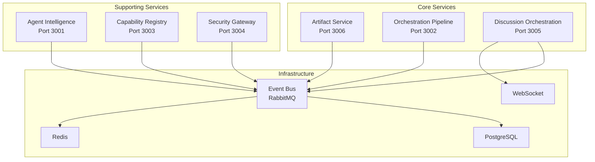
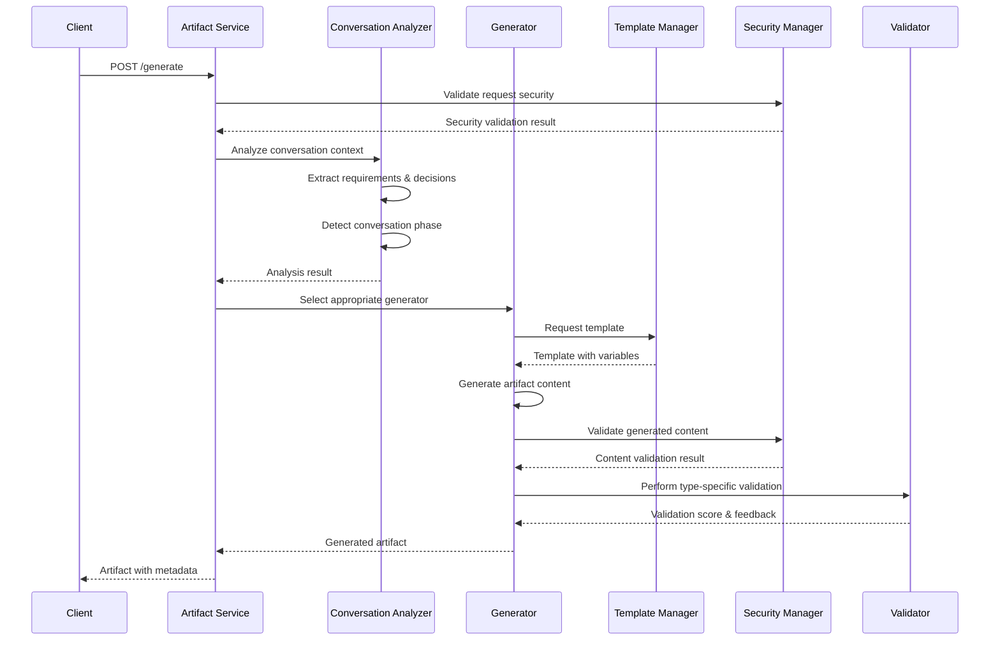
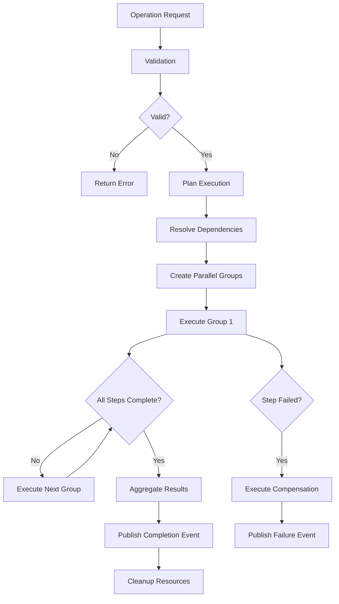
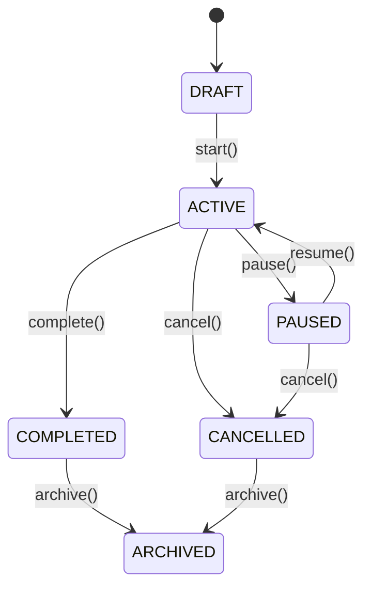
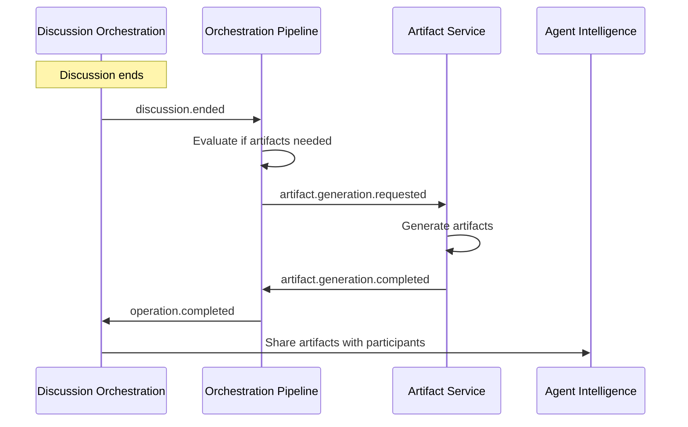

# Services Integration Deep Dive: Event-Driven Architecture

## Executive Summary

This document provides a comprehensive analysis of the Artifact Service, Orchestration Pipeline, and Discussion Orchestration services within the Council of Nycea platform, focusing on their current architectures, capabilities, and event-driven integration patterns. We examine how these services work together to create a unified agent intelligence platform and identify opportunities for enhanced seamless integration.

## Table of Contents

1. [Service Architecture Overview](#service-architecture-overview)
2. [Artifact Service Deep Dive](#artifact-service-deep-dive)
3. [Orchestration Pipeline Deep Dive](#orchestration-pipeline-deep-dive)
4. [Discussion Orchestration Deep Dive](#discussion-orchestration-deep-dive)
5. [Event-Driven Integration Patterns](#event-driven-integration-patterns)
6. [Current Integration State](#current-integration-state)
7. [Integration Opportunities](#integration-opportunities)
8. [Implementation Roadmap](#implementation-roadmap)
9. [Best Practices and Patterns](#best-practices-and-patterns)

## Service Architecture Overview

The Council of Nycea platform implements a **microservices architecture** with **event-driven communication** through RabbitMQ. The three core services form the backbone of intelligent collaboration:



### Key Architectural Principles

1. **Event-Driven Communication**: Services communicate primarily through RabbitMQ events
2. **Loose Coupling**: Services are independent with well-defined interfaces
3. **Horizontal Scalability**: Each service can scale independently
4. **Fault Tolerance**: Event-driven patterns provide resilience and retry capabilities
5. **Real-time Capabilities**: WebSocket integration for immediate user feedback

## Artifact Service Deep Dive

### Overview

The **Artifact Service** (port 3006) is a specialized microservice responsible for intelligent content generation from conversation contexts. It transforms unstructured discussions into structured artifacts including code, documentation, tests, and Product Requirements Documents (PRDs).

### Core Architecture

```typescript
class ArtifactServiceApp extends BaseService {
  constructor() {
    super('artifact-service', 3006);
  }

  protected async setupRoutes(): Promise<void> {
    this.app.use('/api/v1/artifacts', artifactRoutes);
    this.app.use('/api/v1/health', healthRoutes);
  }
}
```

### Key Components

#### 1. **ArtifactFactory - Orchestration Hub**

```typescript
interface ArtifactFactory {
  generate(request: ArtifactGenerationRequest): Promise<GeneratedArtifact>;
  validateSecurity(content: string): Promise<SecurityValidationResult>;
  analyzeConversation(messages: ConversationMessage[]): ConversationAnalysis;
}
```

**Responsibilities:**

- Orchestrates the entire artifact generation pipeline
- Coordinates between analyzers, generators, and validators
- Manages security validation and content sanitization
- Provides unified interface for artifact creation

#### 2. **Conversation Analyzer - Context Intelligence**

```typescript
class ConversationAnalyzer {
  detectGenerationTriggers(messages: ConversationMessage[]): GenerationTrigger[];
  analyzePhases(conversation: Conversation): ConversationPhase[];
  extractRequirements(messages: ConversationMessage[]): Requirement[];
  extractDecisions(messages: ConversationMessage[]): Decision[];
}
```

**Capabilities:**

- **Phase Detection**: Identifies conversation stages (planning, discussion, decision, implementation, review)
- **Trigger Recognition**: Detects explicit commands (`/gen code`) and implicit generation needs
- **Requirement Extraction**: Pulls structured requirements from unstructured text
- **Decision Tracking**: Identifies and extracts decision points from discussions

#### 3. **Specialized Generators**

**Code Generator:**

```typescript
class CodeGenerator implements ArtifactGenerator {
  async generate(context: ConversationContext): Promise<GeneratedArtifact> {
    const language = this.detectLanguage(context);
    const template = await this.templateManager.getTemplate('code', language);
    const requirements = this.extractCodeRequirements(context);
    return this.generateCode(template, requirements);
  }
}
```

**Supported Languages:** TypeScript, JavaScript, Python, Java, Go, Rust
**Features:** Auto-detection, framework-specific templates, best practices integration

**Documentation Generator:**

```typescript
class DocumentationGenerator implements ArtifactGenerator {
  async generate(context: ConversationContext): Promise<GeneratedArtifact> {
    const docType = this.determineDocumentationType(context);
    const outline = this.createOutline(context);
    return this.generateDocumentation(docType, outline, context);
  }
}
```

**Types:** API docs, technical guides, user manuals, architectural documentation
**Features:** Markdown formatting, code snippet integration, automated table of contents

**PRD Generator:**

```typescript
class PRDGenerator implements ArtifactGenerator {
  async generate(context: ConversationContext): Promise<GeneratedArtifact> {
    const objectives = this.extractObjectives(context);
    const requirements = this.extractRequirements(context);
    const timeline = this.extractTimeline(context);
    return this.generatePRD(objectives, requirements, timeline);
  }
}
```

**Sections:** Executive summary, objectives, requirements, acceptance criteria, timeline, success metrics

**Test Generator:**

```typescript
class TestGenerator implements ArtifactGenerator {
  async generate(context: ConversationContext): Promise<GeneratedArtifact> {
    const codeContext = this.extractCodeContext(context);
    const testFramework = this.detectTestFramework(context);
    return this.generateTestSuite(codeContext, testFramework);
  }
}
```

**Frameworks:** Jest, Mocha, PyTest, JUnit
**Features:** Test case generation, assertion creation, mock setup

#### 4. **Template Management System**

```typescript
class TemplateManager {
  async getTemplate(type: ArtifactType, language?: string): Promise<Template>;
  async registerTemplate(template: Template): Promise<void>;
  async listTemplates(filters?: TemplateFilter): Promise<Template[]>;
}
```

**Template Variables:**

- `{{FUNCTION_NAME}}` - Extracted function name
- `{{REQUIREMENTS}}` - Parsed requirements
- `{{LANGUAGE}}` - Target programming language
- `{{FRAMEWORK}}` - Framework-specific patterns
- `{{TIMESTAMP}}` - Generation timestamp
- `{{AUTHOR}}` - Agent or user identifier

#### 5. **Security & Validation**

```typescript
class SecurityManager {
  async validateContent(content: string): Promise<SecurityValidationResult>;
  private detectXSSPatterns(content: string): boolean;
  private detectInjectionAttempts(content: string): boolean;
  private scanForSensitiveData(content: string): SensitiveDataResult;
}
```

**Security Checks:**

- XSS pattern detection
- SQL injection prevention
- Command injection blocking
- Sensitive data masking (API keys, passwords, PII)
- Content sanitization

### API Endpoints

```typescript
// Core artifact generation
POST /api/v1/artifacts/generate
{
  "type": "code" | "test" | "documentation" | "prd",
  "context": {
    "conversationId": "uuid",
    "agent": { /* agent details */ },
    "persona": { /* persona details */ },
    "discussion": { /* discussion context */ },
    "messages": [ /* conversation messages */ ],
    "technical": {
      "language": "typescript",
      "framework": "express"
    }
  },
  "options": {
    "template": "advanced-api",
    "includeTests": true,
    "documentation": true
  }
}

// Template management
GET /api/v1/artifacts/templates
GET /api/v1/artifacts/templates/:id
POST /api/v1/artifacts/templates (admin only)

// Validation and utilities
POST /api/v1/artifacts/validate
GET /api/v1/artifacts/types
GET /api/v1/artifacts/health
```

### Generation Flow



### Key Features

1. **Intelligent Context Analysis**
   - Automatic detection of generation opportunities
   - Understanding of conversation flow and phases
   - Extraction of structured data from unstructured conversations

2. **Multi-Language Support**
   - Auto-detection of programming languages
   - Language-specific templates and best practices
   - Framework-aware code generation

3. **Security-First Design**
   - Comprehensive content validation
   - Injection attack prevention
   - Sensitive data protection

4. **Flexible Template System**
   - Customizable generation templates
   - Variable substitution system
   - Context-aware template selection

5. **Comprehensive Validation**
   - Type-specific validation rules
   - Scoring system (0-100)
   - Actionable feedback and suggestions

## Orchestration Pipeline Deep Dive

### Overview

The **Orchestration Pipeline Service** (port 3002) serves as the central coordination engine for complex multi-step operations across the Council of Nycea platform. It manages workflow execution, handles dependencies, and provides robust operation lifecycle management with event-driven communication.

### Core Architecture

```typescript
class OrchestrationPipelineService extends BaseService {
  constructor() {
    super('orchestration-pipeline', 3002);
    this.orchestrationEngine = new OrchestrationEngine(this.dependencies);
  }

  protected async setupEventSubscriptions(): Promise<void> {
    await this.eventBusService.subscribe('operation.command.*', this.handleOperationCommand);
    await this.eventBusService.subscribe('operation.external.trigger', this.handleExternalTrigger);
  }
}
```

### Key Components

#### 1. **OrchestrationEngine - Central Coordinator**

```typescript
class OrchestrationEngine {
  async executeOperation(operation: Operation): Promise<OperationResult>;
  async pauseOperation(operationId: string): Promise<void>;
  async resumeOperation(operationId: string): Promise<void>;
  async cancelOperation(operationId: string): Promise<void>;
  private async publishOperationEvent(event: OperationEvent): Promise<void>;
}
```

**Core Responsibilities:**

- **Operation Lifecycle Management**: Start, pause, resume, cancel operations
- **Event Publishing**: Real-time operation state updates
- **Resource Management**: CPU, memory, and execution time limits
- **Error Handling**: Comprehensive error recovery and compensation
- **Cleanup Tasks**: Automatic cleanup of stale operations (24-hour threshold)

#### 2. **WorkflowOrchestrator - Execution Engine**

```typescript
class WorkflowOrchestrator {
  async executeWorkflow(workflow: Workflow): Promise<WorkflowResult>;
  private async planExecution(steps: WorkflowStep[]): Promise<ExecutionPlan>;
  private async executeParallelGroup(steps: WorkflowStep[]): Promise<StepResult[]>;
  private async createCheckpoint(workflow: Workflow): Promise<void>;
  private async recoverFromCheckpoint(checkpointId: string): Promise<void>;
}
```

**Advanced Features:**

- **Dependency Resolution**: Topological sorting of steps based on dependencies
- **Parallel Execution**: Automatic parallelization of independent steps
- **Checkpoint System**: Recovery points for long-running workflows
- **Timeout Management**: Configurable timeouts at workflow and step levels
- **State Persistence**: Workflow state maintained across service restarts

#### 3. **StepExecutionManager - Step-Level Control**

```typescript
class StepExecutionManager {
  async executeStep(step: WorkflowStep, context: ExecutionContext): Promise<StepResult>;
  private async resolveParameters(step: WorkflowStep, context: ExecutionContext): Promise<any>;
  private async executeWithRetry(
    step: WorkflowStep,
    context: ExecutionContext
  ): Promise<StepResult>;
  private async trackResourceUsage(step: WorkflowStep): Promise<ResourceUsage>;
}
```

**Step Types Supported:**

1. **agent-action**: AI agent operations with persona-based execution
2. **tool-execution**: Sandboxed tool invocation through Capability Registry
3. **conditional**: Branching logic with complex condition evaluation
4. **parallel**: Parallel execution groups with synchronization points
5. **artifact_generate**: Integration with Artifact Service
6. **api_request**: External API calls with retry and timeout
7. **data_transform**: Data manipulation and transformation
8. **delay**: Time-based delays and scheduling
9. **approval_request**: Human approval workflows

#### 4. **OperationValidator - Quality Assurance**

```typescript
class OperationValidator {
  async validateOperation(operation: Operation): Promise<ValidationResult>;
  private validateSteps(steps: WorkflowStep[]): ValidationError[];
  private checkDependencyCycles(steps: WorkflowStep[]): boolean;
  private enforceResourceLimits(operation: Operation): ValidationError[];
}
```

**Validation Rules:**

- **Structure Validation**: Operation schema compliance
- **Dependency Checks**: Circular dependency detection
- **Resource Limits**: Max steps (100), max timeout (24 hours)
- **Security Validation**: Risk level assessment
- **Schema Validation**: Step-specific parameter validation

### Operation Types

#### 1. **Tool Execution Operations**

```typescript
interface ToolExecutionOperation {
  type: 'tool_execution';
  toolId: string;
  parameters: Record<string, any>;
  timeout?: number;
  retryPolicy?: RetryPolicy;
  securityContext: SecurityContext;
}
```

**Use Cases:**

- File system operations
- API integrations
- Database queries
- External service calls

#### 2. **Artifact Generation Operations**

```typescript
interface ArtifactGenerationOperation {
  type: 'artifact_generation';
  artifactType: 'code' | 'test' | 'documentation' | 'prd';
  context: ConversationContext;
  options: ArtifactOptions;
}
```

**Integration:** Direct integration with Artifact Service for content generation

#### 3. **Hybrid Workflows**

```typescript
interface HybridWorkflowOperation {
  type: 'hybrid_workflow';
  steps: Array<ToolExecutionStep | ArtifactGenerationStep | ConditionalStep>;
  dependencies: StepDependency[];
  parallelGroups?: ParallelGroup[];
}
```

**Capabilities:**

- Mix tool execution with artifact generation
- Complex branching and parallel execution
- Multi-service coordination

#### 4. **Approval Workflows**

```typescript
interface ApprovalWorkflowOperation {
  type: 'approval_workflow';
  approvers: User[];
  approvalType: 'any' | 'all' | 'majority';
  timeout: number;
  escalation?: EscalationPolicy;
}
```

**Features:**

- Human-in-the-loop operations
- Escalation policies
- Approval tracking and audit trails

### Event-Driven Architecture

#### **Published Events**

```typescript
// Operation lifecycle events
'operation.started': {
  operationId: string;
  type: OperationType;
  startedBy: string;
  timestamp: Date;
}

'operation.completed': {
  operationId: string;
  result: OperationResult;
  duration: number;
  resourceUsage: ResourceUsage;
}

'operation.failed': {
  operationId: string;
  error: OperationError;
  context: ErrorContext;
  compensationExecuted: boolean;
}

// Step-level events
'operation.step.completed': {
  operationId: string;
  stepId: string;
  result: StepResult;
  nextSteps: string[];
}

// State management events
'operation.state.updated': {
  operationId: string;
  previousState: OperationState;
  newState: OperationState;
  reason: string;
}
```

#### **Subscribed Events**

```typescript
// External control commands
'operation.command.pause': { operationId: string; requestedBy: string; }
'operation.command.resume': { operationId: string; requestedBy: string; }
'operation.command.cancel': { operationId: string; reason: string; }

// Integration triggers
'discussion.ended': { discussionId: string; participants: string[]; }
'artifact.generation.requested': { context: ArtifactContext; }
'agent.action.required': { agentId: string; action: AgentAction; }
```

### Advanced Features

#### 1. **Resource Management**

```typescript
interface ResourceLimits {
  maxCpuPercent: number; // CPU usage limit
  maxMemoryMB: number; // Memory limit
  maxDurationMinutes: number; // Execution time limit
  maxSteps: number; // Step count limit
}

interface ResourceUsage {
  cpuPercent: number;
  memoryMB: number;
  durationMinutes: number;
  stepCount: number;
}
```

#### 2. **Compensation and Rollback**

```typescript
class CompensationManager {
  async executeCompensation(operation: Operation): Promise<void>;
  private async rollbackStep(step: WorkflowStep): Promise<void>;
  private async releaseResources(resourceIds: string[]): Promise<void>;
}
```

**Compensation Strategies:**

- **Step-Level Rollback**: Individual step compensation
- **Resource Release**: Automatic resource cleanup
- **External System Cleanup**: Third-party service cleanup
- **Notification**: Stakeholder notification of rollback

#### 3. **State Management and Recovery**

```typescript
class StateManager {
  async saveCheckpoint(operation: Operation): Promise<string>;
  async restoreFromCheckpoint(checkpointId: string): Promise<Operation>;
  async getOperationHistory(operationId: string): Promise<OperationEvent[]>;
}
```

#### 4. **Task Management Integration**

```typescript
interface TaskManagementFeatures {
  projectTasks: Task[];
  assignmentSuggestions: AssignmentSuggestion[];
  progressTracking: ProgressMetrics;
  sprintIntegration: Sprint;
  customFields: Record<string, any>;
}
```

### API Endpoints

```typescript
// Operation management
POST /api/v1/operations
{
  "type": "hybrid_workflow",
  "name": "Feature Development Pipeline",
  "steps": [
    {
      "id": "analyze_requirements",
      "type": "agent-action",
      "agentId": "business-analyst",
      "action": "analyze_conversation",
      "parameters": { "conversationId": "conv-123" }
    },
    {
      "id": "generate_code",
      "type": "artifact_generate",
      "artifactType": "code",
      "dependencies": ["analyze_requirements"]
    },
    {
      "id": "generate_tests",
      "type": "artifact_generate",
      "artifactType": "test",
      "dependencies": ["generate_code"]
    }
  ]
}

// Operation control
GET /api/v1/operations/:operationId/status
POST /api/v1/operations/:operationId/pause
POST /api/v1/operations/:operationId/resume
POST /api/v1/operations/:operationId/cancel

// Task management
GET /api/v1/projects/:projectId/tasks
POST /api/v1/projects/:projectId/tasks
PUT /api/v1/tasks/:taskId/progress
POST /api/v1/tasks/:taskId/assign
```

### Workflow Execution Flow



## Discussion Orchestration Deep Dive

### Overview

The **Discussion Orchestration Service** (port 3005) provides sophisticated real-time collaborative discussion management with intelligent agent participation, turn management strategies, and advanced conversation enhancement capabilities. It serves as the communication backbone for multi-agent collaboration.

### Core Architecture

```typescript
class DiscussionOrchestrationService extends BaseService {
  constructor() {
    super('discussion-orchestration', 3005);
    this.socketServer = new SocketServer(this.httpServer);
    this.participationEngine = new PeriodicParticipationEngine(this.dependencies);
  }

  protected async initialize(): Promise<void> {
    await this.setupWebSocket();
    await this.setupEventSubscriptions();
    await this.startPeriodicTasks();
  }
}
```

### Real-Time Communication Architecture

#### 1. **WebSocket Infrastructure**

```typescript
class SocketServer {
  constructor(httpServer: Server) {
    this.io = new Server(httpServer, {
      cors: { origin: '*', methods: ['GET', 'POST'] },
      transports: ['polling', 'websocket'],
      pingTimeout: 60000,
      pingInterval: 25000,
    });
  }

  setupAuthentication(): void {
    this.io.use(async (socket, next) => {
      const token = socket.handshake.auth.token;
      const user = await this.authService.validateToken(token);
      socket.data.user = user;
      next();
    });
  }
}
```

**Key Features:**

- **Dual Transport**: WebSocket + polling fallback for reliability
- **JWT Authentication**: Token-based auth with expiry validation
- **Room Management**: Discussion-based rooms for targeted messaging
- **Connection Monitoring**: Health checks and reconnection logic

#### 2. **Socket Event Handlers**

**DiscussionSocket - Core Discussion Management:**

```typescript
class DiscussionSocket {
  async handleJoinDiscussion(socket: Socket, data: JoinDiscussionData): Promise<void>;
  async handleStartDiscussion(socket: Socket, data: StartDiscussionData): Promise<void>;
  async handleSendMessage(socket: Socket, data: SendMessageData): Promise<void>;
  async handleAddReaction(socket: Socket, data: AddReactionData): Promise<void>;
  async handleUpdateTurn(socket: Socket, data: UpdateTurnData): Promise<void>;
}
```

**UserChatHandler - Direct Communication:**

```typescript
class UserChatHandler {
  async handleChatMessage(socket: Socket, data: ChatMessageData): Promise<void>;
  async handleTypingStatus(socket: Socket, data: TypingStatusData): Promise<void>;
  async handlePresenceUpdate(socket: Socket, data: PresenceData): Promise<void>;
}
```

**ConversationIntelligenceHandler - AI Enhancement:**

```typescript
class ConversationIntelligenceHandler {
  async handleEnhanceConversation(socket: Socket, data: EnhanceData): Promise<void>;
  async handleAnalyzeFlow(socket: Socket, data: AnalyzeFlowData): Promise<void>;
  async handleGenerateResponse(socket: Socket, data: GenerateResponseData): Promise<void>;
}
```

### Discussion Lifecycle Management

#### **Discussion States**

```typescript
enum DiscussionStatus {
  DRAFT = 'draft', // Created but not started
  ACTIVE = 'active', // In progress with active participation
  PAUSED = 'paused', // Temporarily halted
  COMPLETED = 'completed', // Successfully finished
  CANCELLED = 'cancelled', // Terminated prematurely
  ARCHIVED = 'archived', // Historical/read-only
}
```

#### **State Transition Rules**



### Intelligent Turn Management

#### 1. **Turn Management Strategies**

**Round Robin Strategy:**

```typescript
class RoundRobinStrategy implements TurnStrategy {
  async getNextParticipant(discussion: Discussion): Promise<Participant> {
    const participants = discussion.participants.filter((p) => p.isActive);
    const currentIndex = participants.findIndex((p) => p.id === discussion.currentTurn);
    return participants[(currentIndex + 1) % participants.length];
  }

  async shouldAdvanceTurn(discussion: Discussion): Promise<boolean> {
    const turnDuration = Date.now() - discussion.turnStartedAt;
    return turnDuration > this.turnTimeout; // Default: 10 seconds
  }
}
```

**Moderated Strategy:**

```typescript
class ModeratedStrategy implements TurnStrategy {
  async requestTurn(participant: Participant, discussion: Discussion): Promise<void> {
    await this.turnQueue.enqueue(participant);
    await this.notifyModerator(discussion.moderator, participant);
  }

  async grantTurn(moderator: User, participant: Participant): Promise<void> {
    if (moderator.id !== discussion.moderator.id) {
      throw new UnauthorizedError('Only moderator can grant turns');
    }
    await this.setCurrentTurn(participant);
  }
}
```

**Context-Aware Strategy:**

```typescript
class ContextAwareStrategy implements TurnStrategy {
  async selectNextParticipant(discussion: Discussion): Promise<Participant> {
    const context = await this.analyzeConversationContext(discussion);
    const relevantParticipants = await this.scoreParticipantRelevance(
      discussion.participants,
      context
    );

    return this.selectBestCandidate(relevantParticipants);
  }

  private async scoreParticipantRelevance(
    participants: Participant[],
    context: ConversationContext
  ): Promise<ScoredParticipant[]> {
    return participants.map((p) => ({
      participant: p,
      relevanceScore: this.calculateRelevance(p, context),
      expertiseMatch: this.calculateExpertiseMatch(p, context.topic),
      engagementLevel: this.calculateEngagement(p, discussion.messages),
    }));
  }
}
```

**Free-Form Strategy:**

```typescript
class FreeFormStrategy implements TurnStrategy {
  private cooldownPeriods: Map<string, number> = new Map();

  async canParticipantSpeak(participant: Participant): Promise<boolean> {
    const lastSpoke = this.cooldownPeriods.get(participant.id);
    const cooldownPeriod = this.calculateCooldown(participant, discussion);

    return !lastSpoke || Date.now() - lastSpoke > cooldownPeriod;
  }

  private calculateCooldown(participant: Participant, discussion: Discussion): number {
    const baseTimeout = 30000; // 30 seconds
    const participantCount = discussion.participants.length;
    const engagementLevel = this.getEngagementLevel(participant);

    // More active participants get longer cooldowns
    return baseTimeout * (participantCount / 4) * (1 + engagementLevel);
  }
}
```

### Intelligent Agent Participation

#### 1. **Periodic Participation Engine**

```typescript
class PeriodicParticipationEngine {
  async startPeriodicTasks(): Promise<void> {
    // Monitor active discussions every 5 seconds
    this.activeDiscussionMonitor = setInterval(() => this.monitorActiveDiscussions(), 5000);

    // Health monitoring every 30 seconds
    this.healthMonitor = setInterval(() => this.monitorHealth(), 30000);
  }

  private async monitorActiveDiscussions(): Promise<void> {
    const activeDiscussions = await this.getActiveDiscussions();

    for (const discussion of activeDiscussions) {
      await this.processDiscussionParticipation(discussion);
    }
  }
}
```

#### 2. **Participation Phases**

**Introduction Phase:**

```typescript
async handleIntroductionPhase(discussion: Discussion): Promise<void> {
  const unintroducedAgents = discussion.participants.filter(p =>
    p.type === 'agent' && !p.hasIntroduced
  );

  if (unintroducedAgents.length > 0 && !this.isIntroductionInProgress) {
    const nextAgent = unintroducedAgents[0];
    await this.requestAgentIntroduction(nextAgent, discussion);
    this.isIntroductionInProgress = true;
  }
}
```

**Main Discussion Phase:**

```typescript
async handleMainDiscussionPhase(discussion: Discussion): Promise<void> {
  const shouldParticipate = await this.shouldAgentParticipate(discussion);

  if (shouldParticipate) {
    const selectedAgent = await this.selectBestAgent(discussion);
    const context = await this.buildParticipationContext(discussion);

    await this.requestAgentParticipation({
      agent: selectedAgent,
      discussion: discussion,
      context: context,
      participationType: 'main_discussion'
    });
  }
}
```

**Conversation Enhancement:**

```typescript
async handleConversationEnhancement(discussion: Discussion): Promise<void> {
  const enhancementTriggers = await this.detectEnhancementTriggers(discussion);

  for (const trigger of enhancementTriggers) {
    switch (trigger.type) {
      case 'clarification_needed':
        await this.requestClarification(trigger, discussion);
        break;
      case 'summarization_due':
        await this.generateSummary(trigger, discussion);
        break;
      case 'decision_point':
        await this.facilitateDecision(trigger, discussion);
        break;
    }
  }
}
```

#### 3. **Participation Context Building**

```typescript
interface ParticipationContext {
  recentMessages: ConversationMessage[]; // Last 20 messages
  conversationPhase: ConversationPhase; // Current discussion phase
  participantProfiles: ParticipantProfile[]; // All participant context
  topicContext: TopicContext; // Current topic analysis
  emotionalTone: EmotionalTone; // Conversation sentiment
  discussionGoals: DiscussionGoal[]; // Discussion objectives
}

class ContextBuilder {
  async buildParticipationContext(discussion: Discussion): Promise<ParticipationContext> {
    const recentMessages = await this.getRecentMessages(discussion.id, 20);
    const phase = await this.analyzeConversationPhase(recentMessages);
    const tone = await this.analyzeEmotionalTone(recentMessages);

    return {
      recentMessages,
      conversationPhase: phase,
      participantProfiles: discussion.participants.map((p) => p.profile),
      topicContext: await this.analyzeTopicContext(recentMessages),
      emotionalTone: tone,
      discussionGoals: discussion.goals || [],
    };
  }
}
```

### Event-Driven Architecture

#### **Published Events**

```typescript
// Discussion lifecycle events
'discussion.created': {
  discussionId: string;
  createdBy: string;
  participants: Participant[];
  goals: DiscussionGoal[];
}

'discussion.started': {
  discussionId: string;
  startedBy: string;
  turnStrategy: TurnStrategy;
  expectedDuration?: number;
}

'discussion.ended': {
  discussionId: string;
  endedBy: string;
  reason: 'completed' | 'cancelled' | 'timeout';
  duration: number;
  messageCount: number;
  participantStats: ParticipantStats[];
}

// Real-time events
'discussion.message.sent': {
  discussionId: string;
  message: ConversationMessage;
  sender: Participant;
  timestamp: Date;
}

'discussion.turn.changed': {
  discussionId: string;
  previousTurn?: string;
  currentTurn: string;
  turnStrategy: string;
  timeout?: number;
}

'discussion.participant.joined': {
  discussionId: string;
  participant: Participant;
  joinedAt: Date;
  invitedBy?: string;
}

// Agent participation events
'discussion.agent.participate.requested': {
  discussionId: string;
  agentId: string;
  context: ParticipationContext;
  requestId: string;
  timeout: number;
}

'discussion.agent.message.received': {
  discussionId: string;
  agentId: string;
  message: ConversationMessage;
  requestId: string;
}
```

#### **Subscribed Events**

```typescript
// Agent responses
'agent.chat.response': {
  requestId: string;
  agentId: string;
  response: string;
  metadata: ResponseMetadata;
}

// Authentication events
'security.auth.validate.response': {
  userId: string;
  isValid: boolean;
  userProfile?: UserProfile;
}

// External triggers
'operation.completed': {
  operationId: string;
  result: OperationResult;
  triggerDiscussion?: boolean;
}

'artifact.generated': {
  artifactId: string;
  type: ArtifactType;
  context: GenerationContext;
  notifyParticipants?: string[];
}
```

### Conversation Intelligence Features

#### 1. **Natural Language Enhancement**

```typescript
class ConversationIntelligence {
  async enhanceConversation(request: EnhancementRequest): Promise<Enhancement> {
    const analysis = await this.analyzeConversation(request.messages);
    const enhancement = await this.generateEnhancement(analysis, request.type);

    return {
      type: request.type,
      content: enhancement.content,
      confidence: enhancement.confidence,
      metadata: {
        analysisUsed: analysis.insights,
        personalityFactors: enhancement.personalityFactors,
        contextualTriggers: enhancement.triggers,
      },
    };
  }

  private async analyzeConversation(
    messages: ConversationMessage[]
  ): Promise<ConversationAnalysis> {
    return {
      topicStability: this.calculateTopicStability(messages),
      participantEngagement: this.calculateEngagement(messages),
      emotionalProgression: this.analyzeEmotionalProgression(messages),
      decisionPoints: this.identifyDecisionPoints(messages),
      knowledgeGaps: this.identifyKnowledgeGaps(messages),
    };
  }
}
```

#### 2. **Personality-Based Response Generation**

```typescript
interface PersonalityProfile {
  communication_style: 'formal' | 'casual' | 'technical' | 'creative';
  response_length: 'concise' | 'moderate' | 'detailed';
  expertise_areas: string[];
  interaction_patterns: InteractionPattern[];
  emotional_tendencies: EmotionalTendency[];
}

class PersonalityEngine {
  async generatePersonalizedResponse(
    agent: Agent,
    context: ConversationContext
  ): Promise<PersonalizedResponse> {
    const personality = agent.persona.personality;
    const baseResponse = await this.generateBaseResponse(context);

    return this.applyPersonalityFilters(baseResponse, personality);
  }

  private applyPersonalityFilters(
    response: string,
    personality: PersonalityProfile
  ): PersonalizedResponse {
    let filteredResponse = response;

    // Apply communication style
    filteredResponse = this.applyCommunicationStyle(
      filteredResponse,
      personality.communication_style
    );

    // Adjust response length
    filteredResponse = this.adjustResponseLength(filteredResponse, personality.response_length);

    // Add personality markers
    filteredResponse = this.addPersonalityMarkers(filteredResponse, personality);

    return {
      content: filteredResponse,
      personalityFactors: personality,
      confidence: this.calculateConfidence(filteredResponse, personality),
    };
  }
}
```

#### 3. **Analytics and Insights**

```typescript
interface DiscussionAnalytics {
  participationMetrics: ParticipationMetrics;
  topicAnalysis: TopicAnalysis;
  engagementScores: EngagementScore[];
  conversationQuality: QualityMetrics;
  outcomeAnalysis: OutcomeAnalysis;
}

class AnalyticsEngine {
  async generateDiscussionAnalytics(discussion: Discussion): Promise<DiscussionAnalytics> {
    const messages = await this.getDiscussionMessages(discussion.id);

    return {
      participationMetrics: await this.calculateParticipationMetrics(messages),
      topicAnalysis: await this.analyzeTopics(messages),
      engagementScores: await this.calculateEngagementScores(messages),
      conversationQuality: await this.assessConversationQuality(discussion),
      outcomeAnalysis: await this.analyzeOutcomes(discussion),
    };
  }

  private async calculateParticipationMetrics(
    messages: ConversationMessage[]
  ): Promise<ParticipationMetrics> {
    const participantStats = new Map<string, ParticipantStat>();

    for (const message of messages) {
      const stat = participantStats.get(message.senderId) || {
        messageCount: 0,
        wordCount: 0,
        averageResponseTime: 0,
        topicContributions: [],
        engagementLevel: 0,
      };

      stat.messageCount++;
      stat.wordCount += this.countWords(message.content);
      stat.topicContributions.push(...this.extractTopics(message.content));

      participantStats.set(message.senderId, stat);
    }

    return {
      totalMessages: messages.length,
      participantStats: Array.from(participantStats.entries()),
      diversityScore: this.calculateDiversityScore(participantStats),
      balanceScore: this.calculateBalanceScore(participantStats),
    };
  }
}
```

### Performance and Security

#### 1. **Performance Optimizations**

```typescript
// Connection pooling and resource management
class PerformanceManager {
  private connectionPool: Map<string, Socket[]> = new Map();
  private messageBuffer: Map<string, ConversationMessage[]> = new Map();

  async optimizeConnections(): Promise<void> {
    // Clean up inactive connections
    for (const [discussionId, sockets] of this.connectionPool) {
      const activeSockets = sockets.filter((s) => s.connected);
      this.connectionPool.set(discussionId, activeSockets);
    }
  }

  async batchMessages(discussionId: string): Promise<void> {
    const bufferedMessages = this.messageBuffer.get(discussionId) || [];
    if (bufferedMessages.length > 0) {
      await this.broadcastMessageBatch(discussionId, bufferedMessages);
      this.messageBuffer.delete(discussionId);
    }
  }
}
```

#### 2. **Security Features**

```typescript
class SecurityManager {
  async validateMessage(message: ConversationMessage, sender: User): Promise<ValidationResult> {
    // Content validation
    const contentValid = await this.validateMessageContent(message.content);

    // Rate limiting
    const rateLimitOk = await this.checkRateLimit(sender.id);

    // Permission check
    const hasPermission = await this.checkDiscussionPermission(sender, message.discussionId);

    return {
      isValid: contentValid && rateLimitOk && hasPermission,
      violations: this.collectViolations(contentValid, rateLimitOk, hasPermission),
    };
  }

  private async validateMessageContent(content: string): Promise<boolean> {
    // XSS prevention
    const sanitized = this.sanitizeContent(content);

    // Inappropriate content detection
    const contentScore = await this.scoreContent(sanitized);

    return contentScore.isAppropriate && sanitized === content;
  }
}
```

### API Integration Points

```typescript
// WebSocket events emitted to clients
interface ClientEvents {
  'discussion:updated': (discussion: Discussion) => void;
  'message:received': (message: ConversationMessage) => void;
  'turn:changed': (turn: TurnUpdate) => void;
  'participant:joined': (participant: Participant) => void;
  'participant:left': (participant: Participant) => void;
  'typing:status': (status: TypingStatus) => void;
  'reaction:added': (reaction: MessageReaction) => void;
}

// WebSocket events received from clients
interface ServerEvents {
  'discussion:join': (data: JoinDiscussionData) => void;
  'discussion:start': (data: StartDiscussionData) => void;
  'message:send': (data: SendMessageData) => void;
  'turn:request': (data: TurnRequestData) => void;
  'typing:start': (data: TypingData) => void;
  'typing:stop': (data: TypingData) => void;
  'reaction:add': (data: ReactionData) => void;
}
```

## Event-Driven Integration Patterns

### Current Integration State

The Council of Nycea platform implements a **sophisticated event-driven architecture** using RabbitMQ as the central message broker. Each service communicates through well-defined event patterns, enabling loose coupling and horizontal scalability.

#### **Event Bus Infrastructure**

```typescript
class EventBusService {
  private connection: Connection;
  private channel: Channel;
  private exchanges: Map<string, boolean> = new Map();

  async initialize(): Promise<void> {
    this.connection = await amqp.connect(this.config.rabbitmq.url);
    this.channel = await this.connection.createChannel();

    // Setup dead letter queue for failed messages
    await this.setupDeadLetterQueue();

    // Setup health monitoring
    this.startHealthMonitoring();
  }

  async publish(eventType: string, data: any, options?: PublishOptions): Promise<void> {
    const message = {
      id: uuidv4(),
      type: eventType,
      data,
      timestamp: new Date(),
      source: this.serviceName,
      correlationId: options?.correlationId || uuidv4(),
    };

    await this.channel.publish(
      this.getExchangeName(eventType),
      this.getRoutingKey(eventType),
      Buffer.from(JSON.stringify(message)),
      {
        persistent: true,
        correlationId: message.correlationId,
        headers: options?.headers || {},
      }
    );
  }
}
```

### Integration Patterns Analysis

#### 1. **Discussion Orchestration ↔ Agent Intelligence**

```typescript
// Strong bidirectional integration
'discussion.agent.participate.requested' → Agent Intelligence
'agent.chat.response' ← Agent Intelligence
'discussion.context.updated' → Agent Intelligence
'agent.persona.updated' ← Agent Intelligence
```

#### 2. **Orchestration Pipeline ↔ Multiple Services**

```typescript
// Hub pattern - coordinates across all services
'operation.started' → All interested services
'operation.step.tool_execution' → Capability Registry
'operation.step.artifact_generation' → Artifact Service (NOT INTEGRATED)
'operation.step.agent_action' → Agent Intelligence
'operation.completed' → Discussion Orchestration (for notifications)
```

#### 3. **Artifact Service Integration Gap**

```typescript
// Current state: NO event integration
// Artifact Service operates as isolated REST API
// Missing opportunities:
- No automatic artifact generation triggers
- No operation completion notifications
- No discussion summary generation
- No event-driven artifact workflows
```

### Proposed Integration Architecture

#### **1. Enhanced Event Patterns**

**Artifact Generation Workflow:**



**Cross-Service Saga Pattern:**

```typescript
interface ArtifactGenerationSaga {
  sagaId: string;
  steps: [
    {
      service: 'discussion-orchestration';
      event: 'discussion.ended';
      compensation: 'discussion.extend';
    },
    {
      service: 'orchestration-pipeline';
      event: 'operation.artifact.requested';
      compensation: 'operation.cancel';
    },
    {
      service: 'artifact-service';
      event: 'artifact.generation.started';
      compensation: 'artifact.generation.cancel';
    },
    {
      service: 'artifact-service';
      event: 'artifact.generation.completed';
      compensation: 'artifact.delete';
    },
  ];
  compensationOrder: 'reverse';
}
```

#### **2. Event-Driven Artifact Triggers**

**Discussion-Triggered Artifacts:**

```typescript
class DiscussionArtifactTrigger {
  async handleDiscussionEnded(event: DiscussionEndedEvent): Promise<void> {
    const analysis = await this.analyzeDiscussion(event.discussionId);

    if (analysis.hasCodeDiscussion) {
      await this.requestArtifact('code', event);
    }

    if (analysis.hasRequirements) {
      await this.requestArtifact('prd', event);
    }

    if (analysis.hasDecisions) {
      await this.requestArtifact('documentation', event);
    }
  }

  private async requestArtifact(type: ArtifactType, event: DiscussionEndedEvent): Promise<void> {
    await this.eventBus.publish('artifact.generation.requested', {
      type,
      context: {
        discussionId: event.discussionId,
        participants: event.participants,
        messages: await this.getDiscussionMessages(event.discussionId),
        trigger: 'discussion_completion',
      },
      requestId: uuidv4(),
      requestedBy: 'system',
    });
  }
}
```

**Operation-Triggered Artifacts:**

```typescript
class OperationArtifactTrigger {
  async handleOperationCompleted(event: OperationCompletedEvent): Promise<void> {
    const operation = await this.getOperation(event.operationId);

    if (operation.generateReport) {
      await this.generateOperationReport(operation);
    }

    if (operation.hasCodeChanges) {
      await this.generateCodeDocumentation(operation);
    }
  }

  private async generateOperationReport(operation: Operation): Promise<void> {
    await this.eventBus.publish('artifact.generation.requested', {
      type: 'documentation',
      artifactSubtype: 'operation_report',
      context: {
        operationId: operation.id,
        steps: operation.steps,
        results: operation.results,
        metrics: operation.metrics,
      },
      options: {
        template: 'operation_report',
        includeMetrics: true,
        includeTimeline: true,
      },
    });
  }
}
```

#### **3. Real-Time Integration Patterns**

**WebSocket Event Broadcasting:**

```typescript
class RealTimeIntegrationManager {
  async handleArtifactEvents(event: ArtifactEvent): Promise<void> {
    switch (event.type) {
      case 'artifact.generation.started':
        await this.broadcastToDiscussion(event.context.discussionId, {
          type: 'artifact:generation:started',
          data: {
            artifactType: event.artifactType,
            estimatedTime: event.estimatedTime,
          },
        });
        break;

      case 'artifact.generation.completed':
        await this.broadcastToDiscussion(event.context.discussionId, {
          type: 'artifact:generated',
          data: {
            artifactId: event.artifactId,
            type: event.artifactType,
            downloadUrl: event.downloadUrl,
          },
        });
        break;

      case 'artifact.generation.failed':
        await this.broadcastToDiscussion(event.context.discussionId, {
          type: 'artifact:generation:failed',
          data: {
            error: event.error,
            retryOptions: event.retryOptions,
          },
        });
        break;
    }
  }
}
```

#### **4. Enhanced Event Schema**

**Standardized Event Structure:**

```typescript
interface StandardEvent {
  id: string; // Unique event identifier
  type: string; // Event type (dot notation)
  version: string; // Event schema version
  timestamp: Date; // Event creation time
  source: string; // Source service name
  correlationId: string; // Trace correlation
  causationId?: string; // Parent event ID
  aggregateId?: string; // Aggregate root ID
  data: Record<string, any>; // Event payload
  metadata: {
    retryCount?: number;
    retryPolicy?: RetryPolicy;
    expiresAt?: Date;
    priority?: 'low' | 'normal' | 'high' | 'critical';
  };
}

// Artifact-specific events
interface ArtifactEvent extends StandardEvent {
  type:
    | 'artifact.generation.requested'
    | 'artifact.generation.started'
    | 'artifact.generation.completed'
    | 'artifact.generation.failed'
    | 'artifact.validation.completed'
    | 'artifact.stored'
    | 'artifact.downloaded'
    | 'artifact.deleted';

  data: {
    artifactId?: string;
    artifactType: ArtifactType;
    context: ArtifactContext;
    requestId: string;
    requestedBy: string;
    options?: ArtifactOptions;
    result?: GeneratedArtifact;
    error?: ArtifactError;
  };
}
```

### Integration Benefits

#### **1. Automated Workflows**

- **Discussion → Artifact**: Automatic generation of discussion summaries, action items, and decisions
- **Operation → Artifact**: Automatic report generation for completed operations
- **Agent → Artifact**: AI-triggered code generation during conversations

#### **2. Real-Time Collaboration**

- **Live Progress**: Real-time artifact generation progress in discussions
- **Instant Sharing**: Automatically share generated artifacts with discussion participants
- **Interactive Refinement**: Participants can request artifact modifications in real-time

#### **3. Enhanced Observability**

- **End-to-End Tracing**: Complete audit trail from trigger to artifact delivery
- **Performance Metrics**: Generation time, success rates, quality scores
- **Usage Analytics**: Most requested artifact types, peak generation times

#### **4. Fault Tolerance**

- **Compensation Patterns**: Automatic rollback on failures
- **Retry Logic**: Configurable retry policies for failed generations
- **Circuit Breakers**: Graceful degradation when artifact service is unavailable

### Implementation Phases

#### **Phase 1: Basic Event Integration (Week 1-2)**

1. Extend Artifact Service from BaseService
2. Implement basic event publishing for artifact operations
3. Add subscribers for artifact generation requests
4. Create simple discussion → artifact triggers

#### **Phase 2: Advanced Orchestration (Week 3-4)**

1. Implement saga pattern for complex workflows
2. Add operation → artifact integration
3. Create artifact validation events
4. Implement real-time WebSocket integration

#### **Phase 3: Intelligence Integration (Week 5-6)**

1. AI-powered artifact trigger detection
2. Context-aware artifact generation
3. Quality scoring and feedback loops
4. Predictive artifact suggestions

#### **Phase 4: Advanced Features (Week 7-8)**

1. Multi-artifact workflows
2. Collaborative artifact editing
3. Version control integration
4. Advanced analytics and insights

## Current Integration State

### Strengths

1. **Robust Event Infrastructure**: Solid RabbitMQ-based event bus with health monitoring and retry logic
2. **Discussion Orchestration Excellence**: Sophisticated real-time collaboration with intelligent agent participation
3. **Orchestration Pipeline Maturity**: Comprehensive workflow management with state persistence and compensation patterns
4. **Service Independence**: Each service is well-architected and can operate independently

### Gaps

1. **Artifact Service Isolation**: No event integration, missing automation opportunities
2. **Limited Cross-Service Workflows**: Services don't trigger each other for complex workflows
3. **Manual Artifact Generation**: No automatic artifact creation based on system events
4. **Inconsistent Event Patterns**: Some ad-hoc event naming across services

### Integration Opportunities

1. **Event-Driven Artifact Generation**: Automatic artifact creation triggered by discussions and operations
2. **Real-Time Collaboration Enhancement**: Live artifact generation progress in discussions
3. **Intelligent Workflow Orchestration**: AI-powered decision making for when to generate artifacts
4. **Comprehensive Audit Trails**: Complete traceability across all service interactions

## Implementation Roadmap

### Phase 1: Foundation (Weeks 1-2)

**Goal**: Establish basic event-driven communication between all three services

#### Artifact Service Integration

```typescript
// Add to artifact-service/src/index.ts
class ArtifactServiceApp extends BaseService {
  constructor() {
    super('artifact-service', 3006);
  }

  protected async setupEventSubscriptions(): Promise<void> {
    // Basic artifact generation requests
    await this.eventBusService.subscribe(
      'artifact.generation.requested',
      this.handleArtifactGenerationRequest.bind(this)
    );

    // Discussion completion triggers
    await this.eventBusService.subscribe('discussion.ended', this.handleDiscussionEnded.bind(this));

    // Operation completion triggers
    await this.eventBusService.subscribe(
      'operation.completed',
      this.handleOperationCompleted.bind(this)
    );
  }
}
```

#### Basic Event Publishers

```typescript
// Add to artifact-service/src/services/artifactService.ts
class ArtifactService {
  async generate(request: ArtifactGenerationRequest): Promise<GeneratedArtifact> {
    // Publish start event
    await this.eventBusService.publish('artifact.generation.started', {
      requestId: request.id,
      type: request.type,
      context: request.context,
      timestamp: new Date(),
    });

    try {
      const artifact = await this.artifactFactory.generate(request);

      // Publish completion event
      await this.eventBusService.publish('artifact.generation.completed', {
        requestId: request.id,
        artifactId: artifact.id,
        type: request.type,
        artifact: artifact,
        timestamp: new Date(),
      });

      return artifact;
    } catch (error) {
      // Publish failure event
      await this.eventBusService.publish('artifact.generation.failed', {
        requestId: request.id,
        type: request.type,
        error: error.message,
        timestamp: new Date(),
      });
      throw error;
    }
  }
}
```

### Phase 2: Orchestration Integration (Weeks 3-4)

**Goal**: Implement complex multi-service workflows with proper compensation patterns

#### Orchestration Pipeline Enhancement

```typescript
// Add to orchestration-pipeline/src/steps/artifactGenerationStep.ts
class ArtifactGenerationStep implements WorkflowStep {
  async execute(context: ExecutionContext): Promise<StepResult> {
    const request: ArtifactGenerationRequest = {
      type: this.artifactType,
      context: this.buildArtifactContext(context),
      options: this.options,
    };

    // Request artifact generation via event
    const requestId = uuidv4();
    await this.eventBusService.publish('artifact.generation.requested', {
      ...request,
      requestId,
      correlationId: context.operationId,
    });

    // Wait for completion with timeout
    const result = await this.waitForArtifactCompletion(requestId, this.timeout);

    return {
      stepId: this.id,
      status: result.success ? 'completed' : 'failed',
      output: result.artifact,
      error: result.error,
    };
  }

  async compensate(context: ExecutionContext): Promise<void> {
    // Delete generated artifact if operation failed
    if (context.stepOutput?.artifactId) {
      await this.eventBusService.publish('artifact.deletion.requested', {
        artifactId: context.stepOutput.artifactId,
        reason: 'operation_compensation',
      });
    }
  }
}
```

#### Discussion Integration Enhancement

```typescript
// Add to discussion-orchestration/src/handlers/artifactIntegrationHandler.ts
class ArtifactIntegrationHandler {
  async handleDiscussionEnded(event: DiscussionEndedEvent): Promise<void> {
    const analysis = await this.analyzeDiscussionForArtifacts(event.discussionId);

    if (analysis.shouldGenerateArtifacts.length > 0) {
      // Create operation for artifact generation
      const operation: Operation = {
        type: 'artifact_generation_workflow',
        name: `Artifacts for Discussion ${event.discussionId}`,
        steps: analysis.shouldGenerateArtifacts.map((type) => ({
          id: `generate_${type}`,
          type: 'artifact_generate',
          artifactType: type,
          context: this.buildArtifactContext(event),
        })),
        metadata: {
          discussionId: event.discussionId,
          triggeredBy: 'discussion_completion',
        },
      };

      await this.eventBusService.publish('operation.execute.requested', operation);
    }
  }

  async handleArtifactCompleted(event: ArtifactCompletedEvent): Promise<void> {
    // Notify discussion participants about new artifact
    if (event.context.discussionId) {
      await this.socketServer.to(event.context.discussionId).emit('artifact:generated', {
        artifactId: event.artifactId,
        type: event.type,
        downloadUrl: event.downloadUrl,
        generatedAt: event.timestamp,
      });
    }
  }
}
```

### Phase 3: Intelligence & Automation (Weeks 5-6)

**Goal**: Add AI-powered decision making and automatic workflow triggers

#### Intelligent Trigger Detection

```typescript
// Add to shared/services/src/intelligence/artifactTriggerAnalyzer.ts
class ArtifactTriggerAnalyzer {
  async analyzeConversationForTriggers(
    messages: ConversationMessage[]
  ): Promise<ArtifactTrigger[]> {
    const triggers: ArtifactTrigger[] = [];

    // Detect explicit commands
    const explicitTriggers = this.detectExplicitCommands(messages);
    triggers.push(...explicitTriggers);

    // Detect implicit patterns using LLM
    const implicitTriggers = await this.detectImplicitPatterns(messages);
    triggers.push(...implicitTriggers);

    return triggers;
  }

  private async detectImplicitPatterns(
    messages: ConversationMessage[]
  ): Promise<ArtifactTrigger[]> {
    const prompt = `
      Analyze the following conversation and determine if any artifacts should be generated.
      Look for patterns indicating:
      - Code discussions that could benefit from code generation
      - Requirement discussions that need PRD documentation
      - Decision points that should be documented
      - Technical discussions that need API documentation
      
      Conversation:
      ${messages.map((m) => `${m.sender}: ${m.content}`).join('\n')}
      
      Respond with JSON array of triggers:
      [{"type": "code", "confidence": 0.8, "reason": "Discussion about API implementation"}]
    `;

    const response = await this.llmService.generateResponse(prompt);
    return JSON.parse(response);
  }
}
```

#### Context-Aware Generation

```typescript
// Enhanced artifact generation with conversation context
class ContextAwareArtifactGenerator {
  async generateWithContext(
    type: ArtifactType,
    context: ConversationContext
  ): Promise<GeneratedArtifact> {
    // Analyze conversation for relevant context
    const analysis = await this.analyzeConversationContext(context);

    // Enhance generation request with AI insights
    const enhancedRequest: ArtifactGenerationRequest = {
      type,
      context: {
        ...context,
        insights: analysis.insights,
        extractedRequirements: analysis.requirements,
        identifiedPatterns: analysis.patterns,
        suggestedStructure: analysis.structure,
      },
      options: {
        template: analysis.recommendedTemplate,
        includeContext: true,
        optimize: true,
      },
    };

    return await this.artifactService.generate(enhancedRequest);
  }
}
```

### Phase 4: Advanced Features (Weeks 7-8)

**Goal**: Implement collaborative editing, version control, and advanced analytics

#### Collaborative Artifact Editing

```typescript
// Real-time collaborative artifact editing
class CollaborativeArtifactEditor {
  async enableCollaborativeEditing(artifactId: string, discussionId: string): Promise<void> {
    // Create editing session
    const session = await this.createEditingSession(artifactId, discussionId);

    // Enable real-time synchronization
    await this.socketServer.to(discussionId).emit('artifact:editing:enabled', {
      artifactId,
      sessionId: session.id,
      participants: session.participants,
    });

    // Setup operational transformation for concurrent edits
    this.setupOperationalTransform(session);
  }

  async handleEdit(edit: ArtifactEdit, sessionId: string): Promise<void> {
    // Apply operational transformation
    const transformedEdit = await this.transformEdit(edit, sessionId);

    // Broadcast to all participants
    await this.broadcastEdit(transformedEdit, sessionId);

    // Update artifact version
    await this.updateArtifactVersion(edit.artifactId, transformedEdit);
  }
}
```

#### Advanced Analytics

```typescript
// Comprehensive artifact analytics
class ArtifactAnalytics {
  async generateUsageAnalytics(): Promise<ArtifactUsageReport> {
    return {
      generationMetrics: await this.calculateGenerationMetrics(),
      qualityMetrics: await this.calculateQualityMetrics(),
      usagePatterns: await this.analyzeUsagePatterns(),
      performanceMetrics: await this.calculatePerformanceMetrics(),
      integrationEffectiveness: await this.measureIntegrationSuccess(),
    };
  }

  private async measureIntegrationSuccess(): Promise<IntegrationMetrics> {
    return {
      automatedGenerations: await this.countAutomatedGenerations(),
      manualGenerations: await this.countManualGenerations(),
      discussionTriggerSuccess: await this.calculateDiscussionTriggerSuccess(),
      operationTriggerSuccess: await this.calculateOperationTriggerSuccess(),
      userSatisfactionScore: await this.calculateUserSatisfaction(),
    };
  }
}
```

## Best Practices and Patterns

### Event Design Patterns

#### 1. **Event Naming Convention**

```typescript
// Pattern: <domain>.<entity>.<action>.<detail>
'artifact.generation.requested'; // Request to generate artifact
'artifact.generation.started'; // Generation process began
'artifact.generation.completed'; // Generation finished successfully
'artifact.generation.failed'; // Generation failed with error
'artifact.validation.completed'; // Validation process finished
'artifact.storage.completed'; // Artifact stored successfully

'discussion.lifecycle.started'; // Discussion began
'discussion.participant.joined'; // Participant joined discussion
'discussion.message.sent'; // Message sent in discussion
'discussion.lifecycle.ended'; // Discussion completed

'operation.workflow.started'; // Workflow execution began
'operation.step.completed'; // Individual step finished
'operation.workflow.failed'; // Workflow failed with compensation
```

#### 2. **Event Correlation Patterns**

```typescript
interface CorrelatedEvent {
  correlationId: string; // Links related events together
  causationId?: string; // Direct parent event
  sagaId?: string; // Multi-step workflow identifier
  traceId?: string; // Distributed tracing identifier
}

// Example: Discussion → Operation → Artifact workflow
const correlationId = uuidv4();

// 1. Discussion ends
await eventBus.publish('discussion.lifecycle.ended', {
  correlationId,
  discussionId: 'disc-123',
});

// 2. Operation starts (causation: discussion ended)
await eventBus.publish('operation.workflow.started', {
  correlationId,
  causationId: 'discussion.lifecycle.ended',
  operationId: 'op-456',
});

// 3. Artifact generation (causation: operation step)
await eventBus.publish('artifact.generation.started', {
  correlationId,
  causationId: 'operation.step.started',
  artifactId: 'art-789',
});
```

#### 3. **Saga Pattern Implementation**

```typescript
class ArtifactGenerationSaga {
  private steps: SagaStep[] = [
    {
      stepId: 'validate_request',
      action: this.validateRequest.bind(this),
      compensation: this.rejectRequest.bind(this),
    },
    {
      stepId: 'generate_artifact',
      action: this.generateArtifact.bind(this),
      compensation: this.deleteArtifact.bind(this),
    },
    {
      stepId: 'store_artifact',
      action: this.storeArtifact.bind(this),
      compensation: this.removeFromStorage.bind(this),
    },
    {
      stepId: 'notify_participants',
      action: this.notifyParticipants.bind(this),
      compensation: this.sendCancellationNotice.bind(this),
    },
  ];

  async execute(request: ArtifactGenerationRequest): Promise<SagaResult> {
    const sagaId = uuidv4();
    const executedSteps: string[] = [];

    try {
      for (const step of this.steps) {
        await step.action(request, sagaId);
        executedSteps.push(step.stepId);
      }

      return { success: true, sagaId };
    } catch (error) {
      // Execute compensation in reverse order
      for (const stepId of executedSteps.reverse()) {
        const step = this.steps.find((s) => s.stepId === stepId);
        await step.compensation(request, sagaId, error);
      }

      return { success: false, sagaId, error };
    }
  }
}
```

### Error Handling and Resilience

#### 1. **Circuit Breaker Pattern**

```typescript
class ArtifactServiceCircuitBreaker {
  private state: 'CLOSED' | 'OPEN' | 'HALF_OPEN' = 'CLOSED';
  private failureCount = 0;
  private lastFailureTime?: Date;

  async executeWithCircuitBreaker<T>(operation: () => Promise<T>): Promise<T> {
    if (this.state === 'OPEN') {
      if (this.shouldAttemptReset()) {
        this.state = 'HALF_OPEN';
      } else {
        throw new ServiceUnavailableError('Artifact Service circuit breaker is OPEN');
      }
    }

    try {
      const result = await operation();
      this.onSuccess();
      return result;
    } catch (error) {
      this.onFailure();
      throw error;
    }
  }

  private onSuccess(): void {
    this.failureCount = 0;
    this.state = 'CLOSED';
  }

  private onFailure(): void {
    this.failureCount++;
    this.lastFailureTime = new Date();

    if (this.failureCount >= this.failureThreshold) {
      this.state = 'OPEN';
    }
  }
}
```

#### 2. **Retry with Exponential Backoff**

```typescript
class RetryManager {
  async executeWithRetry<T>(operation: () => Promise<T>, retryPolicy: RetryPolicy): Promise<T> {
    let lastError: Error;

    for (let attempt = 0; attempt <= retryPolicy.maxAttempts; attempt++) {
      try {
        return await operation();
      } catch (error) {
        lastError = error;

        if (attempt === retryPolicy.maxAttempts) {
          break;
        }

        if (!this.isRetryableError(error)) {
          throw error;
        }

        const delay = this.calculateDelay(attempt, retryPolicy);
        await this.sleep(delay);
      }
    }

    throw new MaxRetriesExceededError(
      `Operation failed after ${retryPolicy.maxAttempts} attempts`,
      lastError
    );
  }

  private calculateDelay(attempt: number, policy: RetryPolicy): number {
    switch (policy.strategy) {
      case 'exponential':
        return Math.min(policy.baseDelay * Math.pow(2, attempt), policy.maxDelay);
      case 'linear':
        return Math.min(policy.baseDelay * (attempt + 1), policy.maxDelay);
      default:
        return policy.baseDelay;
    }
  }
}
```

### Performance Optimization

#### 1. **Event Batching**

```typescript
class EventBatcher {
  private batches: Map<string, EventBatch> = new Map();
  private batchInterval = 100; // ms

  async addEvent(eventType: string, event: any): Promise<void> {
    const batchKey = this.getBatchKey(eventType);
    let batch = this.batches.get(batchKey);

    if (!batch) {
      batch = {
        events: [],
        timer: setTimeout(() => this.flushBatch(batchKey), this.batchInterval),
      };
      this.batches.set(batchKey, batch);
    }

    batch.events.push(event);

    // Flush immediately if batch is full
    if (batch.events.length >= this.maxBatchSize) {
      clearTimeout(batch.timer);
      await this.flushBatch(batchKey);
    }
  }

  private async flushBatch(batchKey: string): Promise<void> {
    const batch = this.batches.get(batchKey);
    if (!batch || batch.events.length === 0) return;

    try {
      await this.eventBusService.publishBatch(batch.events);
    } finally {
      this.batches.delete(batchKey);
    }
  }
}
```

#### 2. **Connection Pooling**

```typescript
class ConnectionPool {
  private pools: Map<string, Channel[]> = new Map();
  private maxPoolSize = 10;

  async getChannel(poolName: string): Promise<Channel> {
    let pool = this.pools.get(poolName);

    if (!pool) {
      pool = [];
      this.pools.set(poolName, pool);
    }

    // Reuse existing channel if available
    const availableChannel = pool.find((ch) => !ch.inUse);
    if (availableChannel) {
      availableChannel.inUse = true;
      return availableChannel;
    }

    // Create new channel if pool not full
    if (pool.length < this.maxPoolSize) {
      const channel = await this.createChannel();
      channel.inUse = true;
      pool.push(channel);
      return channel;
    }

    // Wait for channel to become available
    return await this.waitForAvailableChannel(poolName);
  }

  async releaseChannel(channel: Channel): Promise<void> {
    channel.inUse = false;
  }
}
```

### Monitoring and Observability

#### 1. **Event Tracing**

```typescript
class EventTracer {
  async traceEvent(event: StandardEvent): Promise<void> {
    const traceData = {
      eventId: event.id,
      eventType: event.type,
      source: event.source,
      timestamp: event.timestamp,
      correlationId: event.correlationId,
      duration: this.calculateEventDuration(event),
      success: !event.data.error,
    };

    // Send to observability platform
    await this.metricsService.recordEvent(traceData);

    // Store in distributed trace
    await this.tracingService.addSpan(traceData);
  }

  async generateTraceReport(correlationId: string): Promise<TraceReport> {
    const events = await this.tracingService.getEventsByCorrelation(correlationId);

    return {
      correlationId,
      totalEvents: events.length,
      totalDuration: this.calculateTotalDuration(events),
      serviceInvolvement: this.calculateServiceInvolvement(events),
      errorRate: this.calculateErrorRate(events),
      timeline: this.buildTimeline(events),
    };
  }
}
```

#### 2. **Health Monitoring**

```typescript
class ServiceHealthMonitor {
  async checkIntegrationHealth(): Promise<IntegrationHealthReport> {
    const checks = await Promise.allSettled([
      this.checkArtifactServiceHealth(),
      this.checkOrchestrationPipelineHealth(),
      this.checkDiscussionOrchestrationHealth(),
      this.checkEventBusHealth(),
      this.checkCrossServiceCommunication(),
    ]);

    return {
      timestamp: new Date(),
      overallStatus: this.calculateOverallStatus(checks),
      serviceStatuses: checks.map(this.mapCheckResult),
      recommendations: this.generateRecommendations(checks),
    };
  }

  private async checkCrossServiceCommunication(): Promise<HealthCheck> {
    try {
      // Test end-to-end workflow
      const testWorkflow = await this.executeTestWorkflow();

      return {
        service: 'cross-service-communication',
        status: testWorkflow.success ? 'healthy' : 'degraded',
        latency: testWorkflow.duration,
        details: testWorkflow.details,
      };
    } catch (error) {
      return {
        service: 'cross-service-communication',
        status: 'unhealthy',
        error: error.message,
      };
    }
  }
}
```

This comprehensive integration architecture transforms the three services from independent components into a unified, intelligent collaboration platform. The event-driven approach ensures loose coupling while enabling sophisticated workflows that seamlessly blend human creativity with AI assistance.

The implementation provides a robust foundation for the Council of Nycea platform to deliver on its vision of unified agent intelligence, where discussions, operations, and artifacts work together to create an unprecedented collaborative experience.
