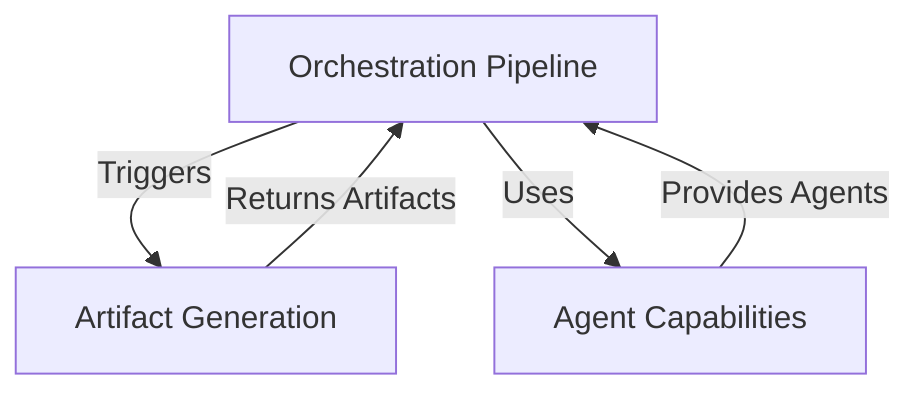
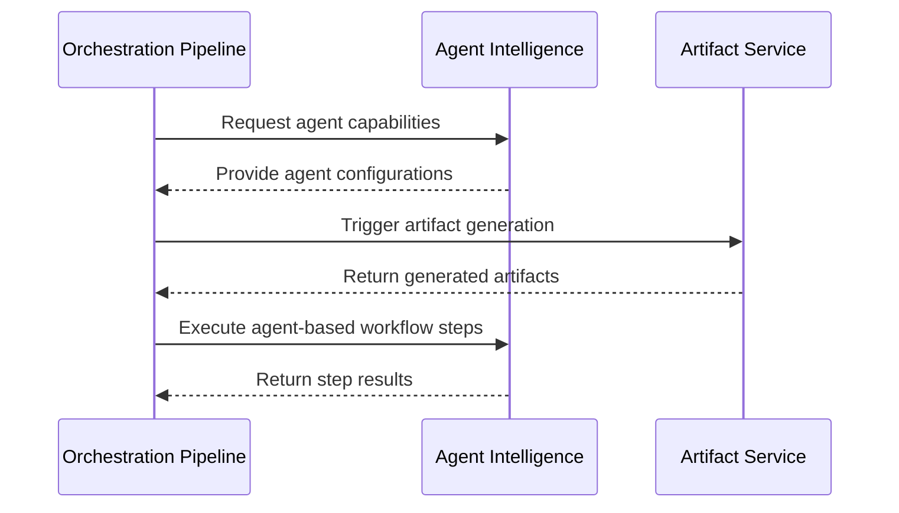
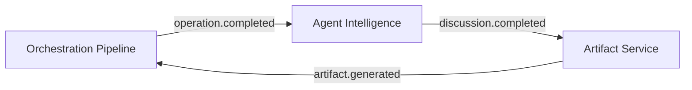

# Orchestration Pipeline Service Integration Analysis

## Service Overviews

### Orchestration Pipeline Service

Manages complex workflow operations through their entire lifecycle. Key features:

- Operation execution with state management
- Pause/resume with checkpointing
- Compensation logic for rollbacks
- monitoring of monitoring of dependent services

### Artifact Service

Generates technical artifacts from discussions. Key features:

- Listens to `discussion.completed` events
- Analyzes conversations using NLP
- Generates code, tests, docs, etc.
- Auto-shares artifacts via short links

### Agent Intelligence Service

Manages AI agents and conversations. Key features:

- Processes `agent.chat.request` events
- Provides conversational interfaces
- Manages personas and knowledge
- Offers conversation enhancement

## Integration Points

## Cross-Service Workflow

## Event Integration

## Code Integration Points

1. **Artifact Service Trigger**:
   - Orchestration Pipeline can call `POST /api/v1/artifacts`
   - Or emit `discussion.completed` events with operation context

2. **Agent Utilization**:
   - Orchestration Engine uses `agent.chat.request` events
   - Direct API calls to `/api/v1/agents`

3. **Shared Infrastructure**:
   - Event bus (`@uaip/event-bus`)
   - Database service (`@uaip/database`)
   - Authentication (`line_count>50line_count>50line_count>50line_count>50line_count>50</line_count>
     </write_to_file>
